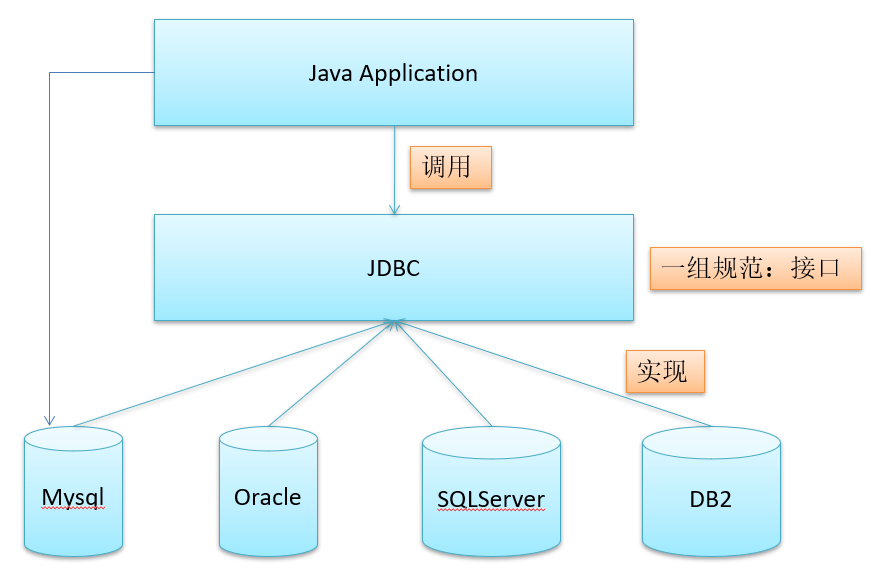

# JPA

## 1 JPA 概述

### 什么是 JPA

什么是 JDBC，JDBC 统一了数据库连接规范。



什么是 JPA：即 Java Persistence API，用于对象持久化的 API，Java EE 5.0 平台标准的 ORM 规范，使得应用程序以统一的方式访问持久层。


JPA 和 Hibernate 的关系：

- JPA 是 hibernate 的一个抽象（就像JDBC和JDBC驱动的关系）。
- JPA 是规范：JPA 本质上就是一种  ORM 规范，不是ORM 框架 —— 因为 JPA 并未提供 ORM 实现，它只是制订了一些规范，提供了一些编程的 API 接口，但具体实现则由 ORM 厂商提供实现。
- Hibernate 是实现：Hibernate 除了作为 ORM 框架之外，它也是一种 JPA 实现。
- 从功能上来说， JPA 是 Hibernate 功能的一个子集。

### JPA 的供应商

JPA 的目标之一是制定一个可以由很多供应商实现的 API，目前Hibernate 3.2+、TopLink 10.1+ 以及 OpenJPA 都提供了 JPA 的实现

1. Hibernate 从 3.2 开始兼容 JPA
2. OpenJPA  是 Apache 组织提供的开源项目
3. TopLink 以前需要收费，如今开源了

### JPA 的优势

- 标准化:  提供相同的 API，这保证了基于 JPA 开发的企业应用能够经过少量的修改就能够在不同的 JPA 框架下运行。
- 简单易用，集成方便: JPA 的主要目标之一就是提供更加简单的编程模型，在 JPA 框架下创建实体和创建 Java 类一样简单，只需要使用 `javax.persistence.Entity` 进行注释；JPA 的框架和接口也都非常简单。
- 可媲美 JDBC 的查询能力:  JPA 的查询语言是面向对象的，JPA 定义了独特的 JPQL，而且能够支持批量更新和修改、JOIN、GROUP BY、HAVING 等通常只有 SQL 才能够提供的高级查询特性，甚至还能够支持子查询。
- 支持面向对象的高级特性: JPA 中能够支持面向对象的高级特性，如类之间的继承、多态和类之间的复杂关系，最大限度的使用面向对象的模型

JPA 包括 3方面的技术：

- ORM 映射元数据：JPA 支持 XML 和 JDK 5.0 注解两种元数据的形式，元数据描述对象和表之间的映射关系，框架据此将实体对象持久化到数据库表中。  
- JPA 的 API：用来操作实体对象，执行 CRUD 操作，框架在后台完成所有的事情，开发者从繁琐的 JDBC和 SQL代码中解脱出来。  
- 查询语言（JPQL）：这是持久化操作中很重要的一个方面，通过面向对象而非面向数据库的查询语言查询数据，避免程序和具体的 SQL 紧密耦合。

## 2 JPA 的基本使用

- [ ] todo

## 3 JPA 基本注解

将 Entity 注解配置在实体类上，可以将其映射为一张表，然后可以通过其他注解进行对表进行具体的配置。

- `@Entity`：用于实体类声明语句之前，指出该Java 类为实体类，将映射到指定的数据库表。如声明一个实体类 Customer，它将映射到数据库中的 customer 表上。
- `@Table`：当实体类与其映射的数据库表名不同名时需要使用 @Table 标注说明，该标注与 @Entity 标注并列使用，置于实体类声明语句之前。
  - @Table 标注的常用选项是 name，用于指明数据库的表名
  - @Table 标注还有两个选项 catalog 和 schema，用于设置表所属的数据库目录或模式，通常为数据库名。
  - uniqueConstraints 选项用于设置约束条件，通常不须设置。
- `@Id`：用于声明一个实体类的属性映射为数据库的主键列。该属性通常置于属性声明语句之前。
- `@GeneratedValue`：用于标注主键的生成策略，通过 strategy 属性指定。默认情况下，JPA 自动选择一个最适合底层数据库的主键生成策略，SqlServer 对应 `identity`，MySQL 对应 `auto increment`。在 `javax.persistence.GenerationType` 中定义了以下几种可供选择的策略：
  - IDENTITY：采用数据库 ID自增长的方式来自增主键字段，Oracle 不支持这种方式。
  - AUTO： JPA自动选择合适的策略，是默认选项。
  - SEQUENCE：通过序列产生主键，通过 @SequenceGenerator 注解指定序列名，MySql 不支持这种方式。
  - TABLE：通过表产生主键，框架借由表模拟序列产生主键，使用该策略可以使应用更易于数据库移植。
- `@Basic`：表示一个简单的属性到数据库表的字段的映射，对于没有任何标注的字段或者 getter 方法，默认即为 `@Basic`。
  - fetch: 表示该属性的读取策略，有 EAGER 和 LAZY 两种，分别表示主支抓取和延迟加载，默认为 EAGER。
  - optional：表示该属性是否允许为null， 默认为true。
- `@Column`：当实体的属性与其映射的数据库表的列不同名时需要使用 @Column 标注说明，该属性通常置于实体的属性声明语句之前，还可与 @Id 标注一起使用。
  - @Column 标注的常用属性是 name，用于设置映射数据库表的列名。此外，该标注还包含其它多个属性，如：unique 、nullable、length 等。
  - @Column 标注的 columnDefinition 属性: 表示该字段在数据库中的实际类型。通常 ORM 框架可以根据属性类型自动判断数据库中字段的类型，但是对于 Date 类型仍无法确定数据库中字段类型究竟是 DATE、TIME 还是 TIMESTAMP。此外，String 的默认映射类型为 VARCHAR, 如果要将 String 类型映射到特定数据库的 BLOB 或TEXT 字段类型，也需要使用 columnDefinition 属性指定。
- `@Transient`：表示该属性并非一个到数据库表的字段的映射，ORM框架将忽略该属性，如果一个属性并非数据库表的字段映射，就务必将其标示为@Transient，因为 ORM 框架默认为其注解 @Basic
- `@Temporal`：在核心的 Java API 中并没有定义 Date 类型的精度(temporal precision)，而在数据库中,表示 Date 类型的数据有 DATE、 TIME 和 TIMESTAMP 三种精度(即单纯的日期、时间、或者两者兼备)，在进行属性映射时可使用 @Temporal 注解来调整精度。

针对于列的注解可以设置在字段声明上，可以注解在 getter 方法上。

### 用 table 来生成主键详解

主键的生成有很多策略，有一种方法是使用一种独立的表来为业务表提供逐渐生成因子。即将当前主键的值单独保存到一个数据库的表中，主键的值每次都是从指定的表中查询来获得，这种方法生成主键的策略可以适用于任何数据库，不必担心不同数据库不兼容造成的问题。

首先我们需要一张表独立的表：

```sql
CREATE TABLE `jpa_id_generators` (
  `ID` int(10) NOT NULL AUTO_INCREMENT,
  `PK_NAME` varchar(50) NOT NULL,
  `PK_VALUE` int(10) NOT NULL,
  PRIMARY KEY (`ID`)
) ENGINE=InnoDB DEFAULT CHARSET=utf8
```

插入相关数据

```log
+----+----------------------+----------+
| ID | PK_NAME              | PK_VALUE |
+----+----------------------+----------+
|  1 | JPA_CUSTOMER_BASE_ID |        1 |
|  2 | ORDER_ID             |      100 |
|  3 | STUDENT_ID           |     1000 |
+----+----------------------+----------+
```

为实体类定义主键生成策略：

```java
    //通过pkColumnName、pkColumnValue、valueColumnName就可以确定表中的唯一个值，该值将作为因子参与主键生成。
    @TableGenerator(
            //策略名称
            name = "ID_GENERATOR",
            //使用该表生成主键
            table = "jpa_id_generators",
            //主键名称
            pkColumnName = "PK_NAME",
            //主键的值
            pkColumnValue = "JPA_CUSTOMER_BASE_ID",
            //用来生成主键的值的列名
            valueColumnName = "PK_VALUE",
            //自增间隔
            allocationSize = 100)
    //指定主键生成策略为 TABLE
    @GeneratedValue(strategy = GenerationType.TABLE, generator = "ID_GENERATOR")
    @Id
    public Integer getId() {
        return id;
    }
```

>用 table 类生成主键值（用的不多，特殊情况需要）

### 3 JPA API

- [ ] todo
