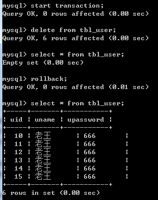

# DML数据操作语言

DML:Data Manipulation Language，作用：用于向数据库表中插入、删除、修改数据，常用关键字：`lINSERT UPDATE DELETE`


---
## 1 INSERT语句

```
//插入单条记录
INSERT INTO table [(column [, column...])] VALUES (value [,value...]);

//插入多条记录
INSERT INTO table VALUES (value [,value...]), (value [,value...]), (value [,value...]);
```


### 注意

- 插入的数据应与字段的数据类型相同。
- 数据的大小应在列的规定范围内，例如：不能将一个长度为80的字符串加入到长度为40的列中。
- 在values中列出的数据位置必须与被加入的列的排列位置相对应。
- **字符和日期型数据应包含在单引号`''`中**
- 插入空值，不指定或insert into table value(null)


---
## 2 UPDATE语句

```
UPDATE tbl_name SET col_name1=expr1 [, col_name2=expr2 ...] [WHERE where_definition]
```

- 修改表格中所有的数据：`update table_name set 字段=new值,.....；`
- 修改某一列的数据` update 表格名 set 字段=new值,...where 字段=条件；`（符合条件的被修改）
- 某字段在原有基础上改变 如int型：`update 表格名 set 属性名=属性名+1000；`where 还可以加条件；（数学数据类型）

### 注意

- UPDATE语法可以用新值更新原有表行中的各列。
- SET子句指示要修改哪些列和要给予哪些值。
- WHERE子句指定应更新哪些行。如没有WHERE子句，则更新所有的行。


---
## 3 DELETE语句

使用 delete语句删除表中数据。

```
delete from _name [WHERE where_definition]
```

### 注意

- 如果不使用where子句，将删除表中所有数据。
- Delete语句不能删除某一列的值（可使用update）
- 使用delete语句仅删除记录，不删除表本身。如要删除表，使用drop table语句。
- 同insert和update一样，**从一个表中删除记录将引起其它表的参照完整性问题，在修改数据库数据时，头脑中应该始终不要忘记这个潜在的问题**。
- 删除表中数据也可使用`TRUNCATE TABLE `语句，它和delete有所不同，TRUNCATE TABLE 表示摧毁整张表，重建表结构，属于DDL，delete删除的时候是一条一条的删除记录，它配合事务，可以将删除的数据找回。truncate删除，它是将整个表摧毁，然后再创建一张一模一样的表。它删除的数据无法找回。




- 删除全部记录：`delete from 表格名（逐条删除 效率低）`
- 删除某一条记录 `delete from 表格名 where ...;`
- 摧毁整张表:`truncate table 表格名 ；`
- delete from后，自增主键不会重置为0

---
## 5 字符编码问题

```
show variables like "character%";//查看MySQL编码

+--------------------------+---------------------------------------------------------+
| Variable_name            | Value                                                   |
+--------------------------+---------------------------------------------------------+
| character_set_client     | gbk                                                     |
| character_set_connection | gbk                                                     |
| character_set_database   | utf8                                                    |
| character_set_filesystem | binary                                                  |
| character_set_results    | gbk                                                     |
| character_set_server     | utf8                                                    |
| character_set_system     | utf8                                                    |
| character_sets_dir       | C:\Program Files\MySQL\MySQL Server 5.7\share\charsets\ |
+--------------------------+---------------------------------------------------------+
```

mysql有六处使用了字符集，分别为：client 、connection、database、results、server 、system。

- client是客户端使用的字符集。
- connection是连接数据库的字符集设置类型，如果程序没有指明连接数据库使用的字符集类型就按照服务器端默认的字符集设置。
- database是数据库服务器中某个库使用的字符集设定，如果建库时没有指明，将使用服务器安装时指定的字符集设置。
- results是数据库给客户端返回时使用的字符集设定，如果没有指明，使用服务器默认的字符集。
- server是服务器安装时指定的默认字符集设定。
- system是数据库系统使用的字符集设定。

### window dos插入中文错误问题

由于DOS命令行是gbk编码的且无法修改，但是又不想修改数据库的编码，解决方法：
1. 添加数据时告诉服务器客户端的编码：`set character_set_client=gbk;`
还要设置显示数据用什么编码：`set character_set_results=gbk;`这时就可以插入中文数据，且显示数据也不会出现乱码
2. 还可以针对某一列进程字符设置比如：设置names列`set names gbk;`。
3. 直接修改数据库安装目录里面的my.ini文件：`default-character-set=utf-8`

---
## 6 DML语言示例

```
    插入一条中文数据：
    mysql>INSERT INTO user (id,username,gender,birthday,entry_date,job,salary,resume) VALUES (3,'袁啟雄','男性','1993-09-03','2014-05-28','CTO',20000,'niu13');

    将所有员工薪水修改为5000元。
    mysql>UPDATE user SET salary=5000;

    将姓名为’zhuzhiguo’的员工薪水修改为3000元。
    mysql>UPDATE user SET salary=3000 WHERE username=’zhuzhiguo’;

    将姓名为’袁啟雄’的员工薪水修改为4000元,job改为ccc。
    mysql>UPDATE user SET salary=4000,job=’CCC’ WHERE username=’袁啟雄’;

    将wujing的薪水在原有基础上增加1000元。
    mysql>UPDATE user SET salary=salary+1000 WHERE username=’wujing’;

    删除表中名称为’zhuzhiguo’的记录。
    mysql>DELETE FROM user WHERE username=’zhuzhiguo’;

    删除表中所有记录。
    mysql>DELETE FROM user;     (逐条删除)

    使用DDL中TRUNCATE删除
    mysql>TRUNCATE TABLE user;(摧毁整张表，重建表结构。属于DDL)
```


