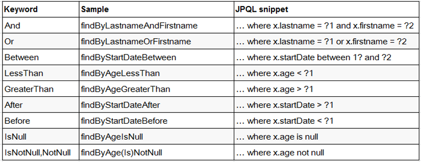
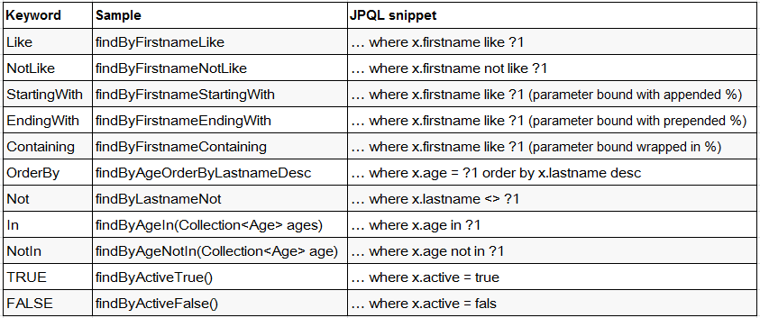

# SpringData-入门

- [spring-data doc](https://spring.io/projects/spring-data)

## 1 Spring Data 概述

Spring Data : Spring 的一个子项目。用于简化数据库访问，支持NoSQL 和 关系数据存储。其主要目标是使数据库的访问变得方便快捷。

SpringData 项目所支持 NoSQL 存储：

- MongoDB （文档数据库）
- Neo4j（图形数据库）
- Redis（键/值存储）
- Hbase（列族数据库）

SpringData 项目所支持的关系数据存储技术：

- JDBC
- JPA

## 2 JPA Spring Data

JPA Spring Data : 致力于减少数据访问层 (DAO) 的开发量，开发者唯一要做的，就只是声明持久层的接口，其他都交给 Spring Data JPA 来帮你完成。框架怎么可能代替开发者实现业务逻辑呢？比如：当有一个 `UserDao.findUserById()` 这样一个方法声明，大致应该能判断出这是根据给定条件的 ID 查询出满足条件的 User 对象。Spring Data JPA 做的便是规范方法的名字，根据符合规范的名字来确定方法需要实现什么样的逻辑。

### 2.1 使用 Spring Data JPA 进行持久层开发

使用 Spring Data JPA 进行持久层开发需要的四个步骤：

1. 配置 Spring 整合 JPA
2. 在 Spring 配置文件中配置 Spring Data，让 Spring 为声明的接口创建代理对象。配置了 `<jpa:repositories>` 后，Spring 初始化容器时将会扫描 base-package  指定的包目录及其子目录，为继承 Repository 或其子接口的接口创建代理对象，并将代理对象注册为 Spring Bean，业务层便可以通过 Spring 自动封装的特性来直接使用该对象。
3. 声明持久层的接口，该接口继承 Repository，Repository 是一个标记型接口，它不包含任何方法，如必要，持久层接口可实现 Repository 其他子接口，其中定义了一些常用的增删改查，以及分页相关的方法。
4. 在接口中声明需要的方法。Spring Data 将根据给定的策略（具体策略稍后讲解）来为其生成实现代码。

### 2.2 Repository 接口概述

1. Repository 接口是 Spring Data 的一个核心接口，它不提供任何方法，开发者需要在自己定义的接口中声明需要的方法 `public interface Repository<T, ID extends Serializable> { }`
2. Spring Data 可以让我们只定义接口，只要遵循 Spring Data 的规范，就无需写实现类。
3. 与继承 Repository 等价的一种方式，就是在持久层接口上使用 `@RepositoryDefinition` 注解，并为其指定 domainClass 和 idClass 属性。两种方式是完全等价的。

**Repository 的子接口**：基础的 Repository 提供了最基本的数据访问功能，其几个子接口则扩展了一些功能。它们的继承关系如下：

1. Repository：仅仅是一个标识，表明任何继承它的均为仓库接口类。
2. CrudRepository：继承 Repository，实现了一组 CRUD 相关的方法。
3. PagingAndSortingRepository：继承 CrudRepository，实现了一组分页排序相关的方法。
4. JpaRepository：继承 PagingAndSortingRepository，实现一组 JPA 规范相关的方法。
5. 自定义的 XxxxRepository 需要继承 JpaRepository，这样的 XxxxRepository 接口就具备了通用的数据访问控制层的能力。
6. JpaSpecificationExecutor： 不属于Repository体系，实现一组 JPA Criteria 查询相关的方法。

CrudRepository 接口提供了最基本的对实体类的添删改查操作：

```java
T save(T entity);//保存单个实体
Iterable<T> save(Iterable<? extends T> entities);//保存集合
T findOne(ID id);//根据id查找实体
boolean exists(ID id);//根据id判断实体是否存在
Iterable<T> findAll();//查询所有实体
long count();//查询实体数量
void delete(ID id);//根据Id删除实体
void delete(T entity);//删除一个实体
void delete(Iterable<? extends T> entities);//删除一个实体的集合
void deleteAll();//删除所有实体
```

PagingAndSortingRepository 接口提供了分页与排序功能：

```java
Iterable<T> findAll(Sort sort); //排序
Page<T> findAll(Pageable pageable); //分页查询（含排序功能）
```

JpaRepository 接口提供了JPA的相关功能：

```java
List<T> findAll(); //查找所有实体
List<T> findAll(Sort sort); //排序、查找所有实体
List<T> save(Iterable<? extends T> entities);//保存集合
void flush();//执行缓存与数据库同步
T saveAndFlush(T entity);//强制执行持久化
void deleteInBatch(Iterable<T> entities);//删除一个实体集合
```

### 2.3 SpringData Repository 方法定义规范

按照规范在 Repository 接口中声明方法，Spring 机会帮我们实现所声明的方法，那么声明方法肯定存在一定的规范。按照 Spring Data 的规范，查询方法以 `find | read | get` 开头，涉及条件查询时，条件的属性用条件关键字连接，要注意的是：条件属性以首字母大写。

例如：定义一个 Entity 实体类：

```java
class User｛
    private String firstName;
    private String lastName;
}
```

使用 And 条件连接时，应这样写：`findByLastNameAndFirstName(String lastName,String firstName);` 条件的属性名称与个数要与参数的位置与个数一一对应。

**支持的关键字**：直接在接口中定义查询方法，如果是符合规范的，可以不用写实现，目前支持的关键字写法如下：




**查询方法解析流程**：假如创建如下的查询：`findByUserDepUuid()`，框架在解析该方法时，首先剔除 findBy，然后对剩下的属性进行解析，假设查询实体为 Doc

1. 先判断 userDepUuid （根据 POJO 规范，首字母变为小写）是否为查询实体的一个属性，如果是，则表示根据该属性进行查询；如果没有该属性，继续第二步；
2. 从右往左截取第一个大写字母开头的字符串(此处为Uuid)，然后检查剩下的字符串是否为查询实体的一个属性，如果是，则表示根据该属性进行查询；如果没有该属性，则重复第二步，继续从右往左截取；最后假设 user 为查询实体的一个属性；
3. 接着处理剩下部分（DepUuid），先判断 user 所对应的类型是否有depUuid属性，如果有，则表示该方法最终是根据 “Doc.user.depUuid” 的取值进行查询；否则继续按照步骤 2 的规则从右往左截取，最终表示根据 “Doc.user.dep.uuid” 的值进行查询。
4. 可能会存在一种特殊情况，比如 Doc 包含一个 user 的属性，也有一个 userDep 属性，此时会存在混淆。可以明确在属性之间加上 "_" 以显式表达意图，比如 "findByUser_DepUuid()" 或者 "findByUserDep_uuid()"
5. 特殊的参数： 还可以直接在方法的参数上加入分页或排序的参数，比如：
   1. `Page<UserModel> findByName(String name, Pageable pageable);`
   2. `List<UserModel> findByName(String name, Sort sort);`

### 2.4 使用 `@Query` 注解

使用方法命名来定义查询逻辑可能导致方法名过长，或者查询很复杂的时候也不好使用方法名来描述，这是可以使用 `@Query` 自定义查询。这种查询可以声明在 Repository 方法中，摆脱像命名查询那样的约束，将查询直接在相应的接口方法中声明，结构更为清晰，这是 Spring data 的特有实现。

```java
    //为 @Query 注解传递参数的方式1: 命名参数的方式.
    @Query("SELECT p FROM Person p WHERE p.lastName = :lastName AND p.email = :email")
    List<Person> testQueryAnnotationParams2(@Param("email") String email, @Param("lastName") String lastName);

    //SpringData 允许在占位符上添加 %%.
    @Query("SELECT p FROM Person p WHERE p.lastName LIKE %?1% OR p.email LIKE %?2%")
    List<Person> testQueryAnnotationLikeParam(String lastName, String email);

    //SpringData 允许在占位符上添加 %%.
    @Query("SELECT p FROM Person p WHERE p.lastName LIKE %:lastName% OR p.email LIKE %:email%")
    List<Person> testQueryAnnotationLikeParam2(@Param("email") String email, @Param("lastName") String lastName);
```

还可以使用@Query来指定本地查询，只要设置 nativeQuery为 true。

```java
    //设置 nativeQuery=true 即可以使用原生的 SQL 查询
    @Query(value = "SELECT count(id) FROM jpa_spring_data_persons", nativeQuery = true)
    long getTotalCount();
```

### 2.5 `@Modifying` 注解和事务

@Query 与 @Modifying 这两个 annotation一起声明，可定义个性化更新操作，例如只涉及某些字段更新时最为常用，示例如下： 

```java
    @Modifying
    @Query("UPDATE Person p SET p.email = :email WHERE id = :id")
    int updatePersonEmail(@Param("id") Integer id, @Param("email") String email);
```

注意：

1. 方法的返回值应该是 int，表示更新语句所影响的行数。
2. 在调用的地方必须加事务，没有事务不能正常执行。

### 2.6 事务

Spring Data 提供了默认的事务处理方式，即所有的查询均声明为只读事务。对于自定义的方法，如需改变 Spring Data 提供的事务默认方式，可以在方法上注解 `@Transactional` 声明，进行多个 Repository 操作时，也应该使它们在同一个事务中处理，按照分层架构的思想，这部分属于业务逻辑层，因此，需要在 Service 层实现对多个 Repository 的调用，并在相应的方法上声明事务。

### 2.7 JpaSpecificationExecutor 接口

JpaSpecificationExecutor 不属于 Repository 体系，其实现一组 JPA Criteria 查询相关的方法，Specification：封装  JPA Criteria 查询条件。通常使用匿名内部类的方式来创建该接口的对象。

```java
@Test
public void testJpaSpecificationExecutor() {

        int pageNo = 3 - 1;
        int pageSize = 5;

        PageRequest pageable = PageRequest.of(pageNo, pageSize);

        /*
         *通常使用 Specification 的匿名内部类：
         *
         *  root: 代表查询的实体类。
         *  query: 可以从中可到 Root 对象, 即告知 JPA Criteria 查询要查询哪一个实体类，还可以来添加查询条件，还可以结合 EntityManager 对象得到最终查询的 TypedQuery 对象。
         *  CriteriaBuilder 对象，用于创建 Criteria 相关对象的工厂，当然可以从中获取到 Predicate 对象
         *
         * 该方法需要返回 Predicate 类型, 代表一个查询条件。
         */
        Specification<Person> specification = (Specification<Person>) (root, query, cb) -> {
            //找到 id 属性
            Path path = root.get("id");
            //gt 表示 greater than，要求属性 id 大于 5。
            Predicate predicate = cb.gt(path, 5);
            return predicate;
        };

        Page<Person> page = mPersonRepository.findAll(specification, pageable);
}
```

### 2.8 自定义 Repository 方法

**1 为某一个 Repository 上添加自定义方法**：

1. 定义一个接口: 声明要添加的, 并自实现的方法。
2. 提供该接口的实现类: 类名需在要声明的 Repository 后添加 Impl, 并实现方法。
3. 声明 Repository 接口, 并继承步骤 1 声明的接口使用。

注意: 默认情况下, Spring Data 会在 base-package 中查找 "接口名Impl" 作为实现类，也可以通过 `repository-impl-postfix` 声明后缀。

**2 为所有的 Repository 都添加自实现的方法**：

参考 [repositories](https://docs.spring.io/spring-data/elasticsearch/docs/1.0.0.M1/reference/html/repositories.html)，该方式在 2.0 版本上会报错，`No suitable constructor found on interface com.atguigu.springdata.commonmethod.CommonMethodTest to match the given arguments:`，暂时没有找到解决方法。
