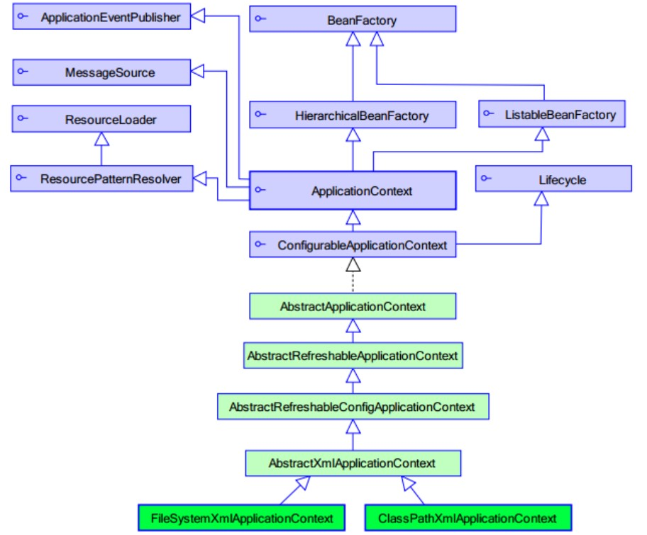

# Spring 快速入门

---

## 1 Spring 简介

Spring是一个开源框架，Spring是于 **2003** 年兴起的一个轻量级的Java 开发框架，由`Rod Johnson`在其著作`Expert One-On-One J2EE Development and Design`中阐述的部分理念和原型衍生而来。它是为了解决企业应用开发的 **复杂性** 而创建的。框架的主要优势之一就是其 **分层架构**。Spring使用基本的JavaBean来完成以前只可能由EJB完成的事情。然而，Spring的用途不仅限于服务器端的开发。从简单性、可测试性和松耦合的角度而言，任何Java应用都可以从Spring中受益。Spring的核心是 **控制反转（Inversion of Control 简称 Ioc）** 和 **面向切面（Aspect Oriented Programming 简称 AOP）**。简单来说，Spring是一个分层的`JavaSE/JavaEE full-stack`(一站式) 轻量级开源框架。Spring的框架性质是属于 **容器性质** 的，容器中有什么对象就具备什么功能。

### 1.1 Spring 优点

- **方便解耦，简化开发**：Spring就是一个大工厂，可以将所有对象创建和依赖关系维护，交给Spring管理
- **AOP编程的支持**：Spring提供面向切面编程，可以方便的实现对程序进行权限拦截、运- 行监控等功能
- **声明式事务的支持**：只需要通过配置就可以完成对事务的管理，而无需手动编程
- **方便程序的测试**：Spring提供了对Junit4的支持，可以通过注解方便的测试Spring程序
- **方便集成各种优秀框架**：Spring不排斥各种优秀的开源框架，其内部提供了对各种优秀框架（如：Struts、Hibernate、MyBatis、Quartz等）的直接支持
- **降低JavaEE API的使用难度**：Spring 对JavaEE开发中非常难用的一些API（JDBC、JavaMail、远程调用等）都提供了封装，使这些API应用难度大大降低

### 1.2 Spring 核心概念

- **IOC**：`Inversion of Control`控制反转，指的是在本来由对象自身创建所依赖的其他对象的方式的情况下，将对象的创建权反转(交给)给 Spring，由主动创建变成被动接收，作用是实现了程序的解耦合。
- **DI**：`Dependency Injection`依赖注入，可以理解为控制反转的一种形式，创建对象依赖的其他对象不由对象自己创建，而是由它的创建则进行注入，常见的注入方式有构造方法注入、Setter注入、依赖注入框架。
- **AOP**：`Aspect Oriented Programming`面向方面的编程，它允许程序员对横切关注点或横切典型的职责分界线的行为（例如日志和事务管理）进行模块化。AOP 的核心构造是方面，它将那些影响多个类的行为封装到可重用的模块中。

---

## 2 基础配置与容器对象

### 2.1 ApplicationContext 与 BeanFactory 容器对象

Spring容器启动时就会创建容器中配置的所有对象，下面两个类用于加载Spring的配置文件：

- `ClassPathXmlApplicationContext`：加载类路径下 Spring 的配置文件
- `FileSystemXmlApplicationContext`：加载本地磁盘下 Spring 的配置文件

ApplicationContext 与 BeanFactory 都是 Spring 的容器对象，Spring容器架构如下：

BeanFactory 和 ApplicationContext 的区别

- BeanFactory 是 spring 原始接口，针对原始接口的实现类功能较为单一，BeanFactory 接口实现类的容器的特点是每次在获得对象时才会创建对象。即在 getBean 的时候才会生成类的实例。
- ApplicationContext：在加载 applicationContext.xml(容器启动)时候就会创建。
- web 开发中，使用 applicationContext， 在资源匮乏的环境可以使用 BeanFactory。

### 2.1 Bean 的配置方式

- 在 Spring 配置文件中声明一个 Bean
- 分模块配置，import 导入其他配置文件
- Bean创建的三种方式
  - 空参构造创建
  - 静态工厂创建
  - 实例工厂创建

### 2.2 Bean 的 Scope 与 生命周期配置

四种 scope：

- **singleton**(默认值)：单例对象，被标识为单例的对象在spring容器中只会存在一个实例
- **prototype**：多例原型，被标识为多例的对象，每次再获得才会创建，每次创建都是新的对象
- **request**：web环境下，对象与request生命周期一致
- **session**：web环境下，对象与session生命周期一致

生命周期：

- **初始化**：配置一个方法作为生命周期初始化方法.spring会在对象创建之后立即调用，`init-method`
- **销毁**：配置一个方法作为生命周期的销毁方法，spring容器在关闭并销毁所有容器中的对象之前调用，`destroy-method`

---

## 3 Spring 注入

### 3.1 xml 配置注入

- setter 方法
- 构造函数注入
- p 名称空间注入：会调用属性的set方法，注意导入P名称空间：`xmlns:p="http://www.springframework.org/schema/p"`
- spel注入：spring Expression Language spring
- 复杂类型注入：包括：`数组、map、properties、list`

### 3.2 注解注入

#### 开启注解

1. 导入 spring-aop 模块(默认已经导入了)
2. 主配置文件引入 `context` 命名空间(约束)
3. 开启配置：`<context:component-scan base-package="package-name"/>`

#### 组件注解

Spring 提供了下面四个注解，如果类上声明了注解的，那么 Spring 会创建该类的对象并放入到容器中，并可以对容器的一些属性声明进行注入：

- `@Component`
- `@Service`
- `@Controller`
- `@Repository`

Component 是最原始的注解，但是如果所有的组件都使用 Component 注解，在语义上就分辨不出对象到底是属于那一层，是属于什么类型的组件，所以后台就添加了另外三个注解，其实它们的作用都是一样的。

#### Scope 注解

`@Scope` 注解用于指定组件的范围

#### 属性注入注解

值类型属性注入：

- Value：可以定义在字段上也可以定义在Setter方法上

引用类型属性注入：

- Autowired：自动装配，会自动在容器中根据类型找。
- Qualifier：配合Autowired使用，告诉 Autowired 使用哪个名称的对象。
- Resource：指定注入哪个名称的对象。

#### 生命周期注解

- PreConstruct：初始化
- PostConstruct：注解

---

## 4 Spring 配合 JUnit 测试

- 添加 Spring Test 依赖
- 添加 RunWith 注解
- 添加 SpringJUnit4ClassRunner 注解，指定配置文件位置，用于帮助创建容器

---

## 5 AOP

AOP 最早由 AOP 联盟的组织提出，并制定了一套规范，Spring 将 AOP 思想引入到框架中，必须遵守 AOP 联盟的规范。AOP的底层实现是**代理机制**: Spring的 AOP 的底层用到两种代理机制：

- JDK 的动态代理：针对实现了接口的类产生代理
- CgLib 的动态代理：针对没有实现接口的类产生代理，应用的是底层的字节码增强的技术生成当前类的子类对象

### 5.1 Spring 基于 AspectJ 的 AOP 开发

AspectJ 是 Java 社区里最完整最流行的 AOP 框架，在 Spring2.0 以上版本中, 可以使用基于 AspectJ 注解或基于 XML 配置的 AOP。

>（Spring本身有一套 AOP 框架，但是更推荐使用 AspectJ ）

AOP的开发中的相关术语：

- **Joinpoint**(连接点)：所谓连接点是指那些被拦截到的点。在spring中，这些点指的是方法，因为spring只支持方法类型的连接点
- **Pointcut**(切入点)：所谓切入点是指我们要对哪些Joinpoint进行拦截的定义
- **Advice**(通知/增强)：所谓通知是指拦截到Joinpoint之后所要做的事情就是通知，通知分为前置通知,后置通知、异常通知、最终通知、环绕通知(切面要完成的功能)
- **Introduction**(引介)：引介是一种特殊的通知，在不修改类代码的前提下, Introduction可以在运行期为类动态地添加一些方法或Field
- **Target**(目标对象)：代理的目标对象
- **Weaving**(织入)：是指把增强应用到目标对象来创建新的代理对象的过程，spring采用动态代理织入，而AspectJ采用编译期织入和类装载期织入
- **Proxy**（代理）：一个类被AOP织入增强后，就产生一个结果代理类
- **Aspect**(切面)：是切入点和通知（引介）的结合

### 5.2 切入点

- 前置通知：在目标方法执行之前执行
- 后置通知：在目标方法执行之后执行
- 环绕通知：在目标方法执行前和执行后执行
- 异常抛出通知：在目标方法执行出现异常的时候执行
- 最终通知：无论目标方法是否出现异常最终通知都会执行

### 5.3 配置 Advice

- xml配置方式
- 注解配置方式

---

## 6 Srping JDBC

### 6.1 JDBC 模板

spring 提供了很多模板整合 Dao 技术

ORM 技术 | 模板类
--- | ---
JDBC | `org.springframework.jdbc.core.JdbcTemplate`
HIBERNATE | `org.springframework.orm.hibernate3.HibernateTemplate`
IBatis(MyBatis) | `org.springframework.orm.ibatis.SqlMapClientTemplate`
JPA | `org.springframework.orm.jpa.JpaTemplate`

DAO 实现类可以继承 JdbcDaoSupport，其提供 Template 类的获取。

### 6.2 事务简介

事务：逻辑上的一组操作，组成这组操作的各个逻辑单元，要么一起成功，要么一起失败。

事务特性：

- 原子性 :强调事务的不可分割
- 一致性 :事务的执行的前后数据的完整性保持一致
- 隔离性 :一个事务执行的过程中，不应该受到其他事务的干扰
- 持久性 :事务一旦结束，数据就持久到数据库

如果不考虑隔离性引发安全性问题

- 脏读：一个事务读到了另一个事务的未提交的数据
- 不可重复读：一个事务读到了另一个事务已经提交的 `update` 的数据导致多次查询结果不一致
- 虚幻读：一个事务读到了另一个事务已经提交的 `insert` 的数据导致多次查询结果不一致

解决读问题——设置事务隔离级别

- 未提交读 :脏读，不可重复读，虚读都有可能发生
- 已提交读 :避免脏读，但是不可重复读和虚读有可能发生
- 可重复读 :避免脏读和不可重复读，但是虚读有可能发生
- 串行化的 :避免以上所有读问题

### 6.3 Spring 事务管理

PlatformTransactionManager 平台事务管理器，这是一个接口，针对不同平台有不同的实现：

- `org.springframework.jdbc.datasource.DataSourceTransactionManager` 使用 Spring JDBC 或 iBatis 进行持久化数据时使用
- `org.springframework.orm.hibernate3.HibernateTransactionManager` 使用 Hibernate 版本进行持久化数据时使用

TransactionDefinition 事务定义信息：

- 隔离级别
- 传播行为
- 超时信息
- 是否只读

TransactionStatus 事务的状态：

- 记录事务的状态

Spring 的这组接口是如何进行事务管理：平台事务管理根据事务定义的信息进行事务的管理，事务管理的过程中产生一些状态，将这些状态记 录到 TransactionStatus 里面。

事务的传播行为：ServiceA 调用 ServiceB，两个Service都有各自的事务逻辑，那么如果处理这个问题？

- 保证同一个事务中
  - `PROPAGATION_REQUIRED` 支持当前事务，如果不存在 就新建一个(默认)
  - `PROPAGATION_SUPPORTS` 支持当前事务，如果不存在，就不使用事务
  - `PROPAGATION_MANDATORY` 支持当前事务，如果不存在，抛出异常
- 保证没有在同一个事务中
  - `PROPAGATION_REQUIRES_NEW` 如果有事务存在，挂起当前事务，创建一个新的事务  
  - `PROPAGATION_NOT_SUPPORTED` 以非事务方式运行，如果有事务存在，挂起当前事务
  - `PROPAGATION_NEVER` 以非事务方式运行，如果有事务存在，抛出异常
  - `PROPAGATION_NESTED` 如果当前事务存在，则嵌套事务执行

事务的配置方式

- xml
- 注解
