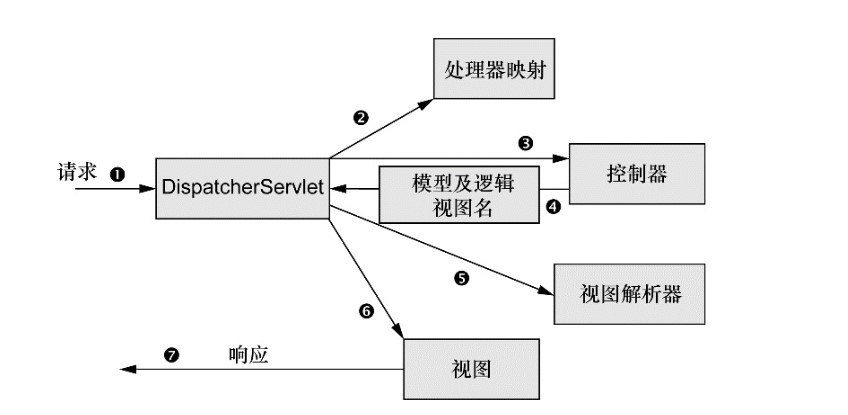

>第二部分：5-9章

# 第五章：构建 Spring Web 应用

Spring MVC 是基于模型-视图-控制器（Model-View-Controller，MVC）模式实现，它能够帮你构建像 Spring 框架那样灵活和松耦合的 Web 应用程序。

---
## 1 Spring MVC 起步

Spring MVC 的工作流程：

以一次请求为例，使用 Spring MVC 处理请求所经历的过程如下：

1. 在请求离开浏览器时，会带有用户所请求内容的信息，包含请求的 URL 和用户提交的信息。
2. SpringMVC 处理的第一站是 Spring 的 DispatcherServlet，Spring MVC 所有的请求都会通过一个前端控制器（front controller）Servlet，而 DispatcherServlet 就是这个前端控制器。
3. DispatcherServlet 的任务是将请求发送给 Spring MVC 控制器（controller）。控制器是一个用于处理请求的 Spring 组件。
4. DispatcherServlet 会查询一个或多个处理器映射（handler mapping）来确定请求的下一站在哪里。处理器映射会根据请求所携带的 URL 信息来进行决策。
5. 一旦选择了合适的控制器，DispatcherServlet 会将请求发送给选中的控制器。
6. 到了控制器，请求会卸下其负载（用户提交的信息）并耐心等待控制器处理这些信息。
7. 控制器在完成逻辑处理后，通常会产生一些信息，这些信息需要返回给用户并在浏览器上显示。这些信息被称为模型（model）。
8. 最后控制器将模型数据打包，并且标示出用于渲染输出的视图名。它接下来会将请求连同模型和视图名发送回 DispatcherServlet。
9. 传递给 DispatcherServlet 的视图名并不直接表示某个特定的页面(比如 JSP 或其他视图)，它仅仅传递了一个逻辑名称，这个名字将会用来查找产生结果的真正视图。
10. DispatcherServlet 将会使用视图解析器（view resolver）来将逻辑视图名匹配为一个特定的视图实现。
11. DispatcherServlet知道由哪个视图渲染结果后，那请求的任务基本上也就完成了。它的最后一站是视图的实现（可能是JSP），在这里它交付模型数据。请求的任务就完成了。

---
## 2 JavaConfig 方式搭建 Spring MVC

### 配置 DispatcherServlet

DispatcherServlet 是Spring MVC的核心。它要负责将请求路由到其他的组件之中。按照传统的方式，像DispatcherServlet 这样的 Servlet 会配置在web.xml文件中，但是，借助于 Servlet 3规范和 Spring 3.1 的功能增强，可以直接使用 JavaConfig 配置

#### 两个应用上下文

- 当 DispatcherServlet 启动的时候，它会创建 Spring 应用上下文，并加载配置文件或配置类中所声明的 bean，DispatcherServlet 加载包含 Web 组件的 bean，如控制器、视图解析器以及处理器映射
- 另外的这个应用上下文由 ContextLoaderListener 创建，ContextLoaderListener 加载应用中的其他 bean。这些 bean 通常是驱动应用后端的中间层和数据层组件。

#### AbstractAnnotationConfigDispatcherServletInitializer

继承该类的任意类都会自动地配置 DispatcherServlet 和 Spring 应用上下文，Spring 的应用上下文会位于应用程序的 Servlet 上下文之中。在 Servlet 3.0 环境中，容器会在类路径中查找实现 `javax.servlet.ServletContainerInitializer` 接口的类，如果能发现的话，就会用它来配置 Servlet 容器。Spring 提供了这个接口的实现，名为 SpringServletContainerInitializer，这个类反过来又会查找实现 WebApplicationInitializer 的类并将配置的任务交给它们来完成。Spring 3.2 引入了一个便利的 WebApplicationInitializer 基础实现，也就是 AbstractAnnotationConfigDispatcherServletInitializer。只要初始化类扩展了AbstractAnnotationConfigDispatcherServletInitializer（同时也就实现了 WebApplicationInitializer），当部署到Servlet 3.0容器中的时候，容器就会自动发现它，并用它来配置 Servlet 上下文。

AbstractAnnotationConfigDispatcherServletInitializer 的三个方法：

- getServletMappings() 方法
- getServletConfigClasses()方法
- getRootConfigClasses()方法

### 启用Spring MVC

- 使用 `<mvc:annotation-driven>` 启用注解驱动的 Spring MVC
- 使用 `@EnableWebMvc` 注解启用 Spring MVC

Spring MVC 配置类继承 WebMvcConfigurerAdapter。

### 控制器

- 接收参数：包括查询参数、路径参数、表单参数
- 传递参数
- 验表单
- 返回视图

一些细节：

-  **细节1-模型key的自动推断**：当调用addAttribute()方法并且不指定key的时候，那么key会根据值的对象类型推断确定。比如 `Spitter 推断为 spitter`；`List<Spittle> 推断为 spittleList`。
-  **细节2-逻辑视图自动推断**：Controller 的方法没有返回视图名称而是直接返回数据，也没有显式地设定模型，数据会自动放入模型中，key 根据细节1 自动推断，而逻辑视图的名称将会根据请求路径推断得出。
-  **表单校验**：使用 Spring 对 Java 校验 API（Java ValidationAPI，又称JSR-303）的支持。从 Spring 3.0 开始，在 Spring MVC 中提供了对 Java 校验 API 的支持。在 Spring MVC 中要使用 Java 校验 API 的话，并不需要什么额外的配置。只要保证在类路径下包含这个 Java API 的实现即可，比如 Hibernate Validator。

Java校验API所提供的校验注解：

注解 | 描述
---|---
`@AssertFalse` | 所注解的元素必须是Boolean类型，并且值为false
`@AssertTrue` | 所注解的元素必须是Boolean类型，并且值为true
`@DecimalMax` | 所注解的元素必须是数字，并且它的值要小于或等于给定的BigDecimalString值
`@DecimalMin` | 所注解的元素必须是数字，并且它的值要大于或等于给定的BigDecimalString值
`@Digits` | 所注解的元素必须是数字，并且它的值必须有指定的位数
`@Future` | 所注解的元素的值必须是一个将来的日期
`@Max` | 所注解的元素必须是数字，并且它的值要小于或等于给定的值
`@Min` | 所注解的元素必须是数字，并且它的值要大于或等于给定的值
`@NotNull` | 所注解元素的值必须不能为null
`@Null` | 所注解元素的值必须为null
`@Past` | 所注解的元素的值必须是一个已过去的日期
`@Pattern` | 所注解的元素的值必须匹配给定的正则表达式
`@Size` | 所注解的元素的值必须是String、集合或数组，并且它的长度要符合给定的范围

### 测试

从 Spring 3.2 开始，可以按照控制器的方式来测试 Spring MVC 中的控制器了，而不仅仅是作为 POJO 进行测试。Spring 包含了一种 mock Spring MVC 并针对控制器执行 HTTP 请求的机制。这样的话，在测试控制器的时候，就没有必要再启动 Web 服务器和 Web 浏览器了。
