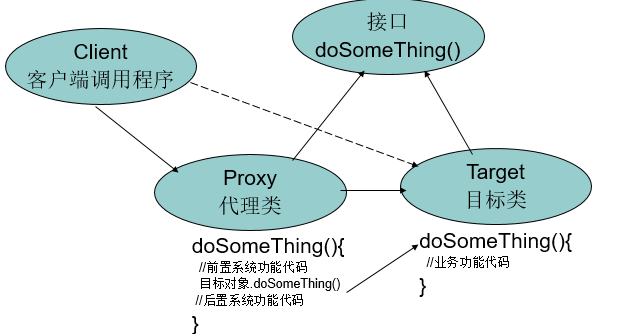

# 代理

要为已存在的多个具有相同接口的目标类的各个方法**增加一些系统功能**，例如，异常处理、日志、计算方法的运行时间、事务管理、等等，你准备如何做？

编写一个与目标类具有相同接口的代理类，代理类的每个方法调用目标类的相同方法，并在调用方法时加上系统功能的代码。 如果采用工厂模式和配置文件的方式进行管理，则不需要修改客户端程序，在配置文件中配置是使用目标类、还是代理类，这样以后很容易切换，譬如，想要日志功能时就配置代理类，否则配置目标类，这样，增加系统功能很容易，以后运行一段时间后，又想去掉系统功能也很容易



## 动态代理与静态代理

### 静态代理

要为系统中的各种接口的类增加代理功能，那将需要太多的代理类，全部采用静态代理方式，将是一件非常麻烦的事情！写成百上千个代理类，是不是太累！

### 动态代理

- JVM可以在运行期动态生成出类的字节码，这种动态生成的类往往被用作代理类，即动态代理类。
- JVM生成的动态类必须实现一个或多个接口，所以，JVM生成的动态类只能用作具有相同接口的目标类的代理。
- CGLIB库可以动态生成一个类的子类，一个类的子类也可以用作该类的代理，所以，如果要为一个没有实现接口的类生成动态代理类，那么可以使用CGLIB库。

代理类的各个方法中通常除了要调用目标的相应方法和对外返回目标返回的结果外，还可以在代理方法中的如下四个位置加上系统功能代码

1. 在调用目标方法之前
2. 在调用目标方法之后
3. 在调用目标方法前后
4. 在处理目标方法异常的catch块中

调用代理对象的从Object类继承的`hashCode, equals, 或toString`这几个方法时，代理对象将调用请求**转发给InvocationHandler对象**，对于其他方法，则不转发调用请求。

## Java动态代理一般使用姿势

```java
//获取代理类
private static Object getProxy(final Object target, final Advice advice) {

return Proxy.newProxyInstance(
        target.getClass().getClassLoader(),
        target.getClass().getInterfaces(),
        (arg0, arg1, arg2) -> {
            advice.beforeMethod(arg1);
            Object retVal = arg1.invoke(target, arg2);
            advice.afterMethod(arg1);
            return retVal;
        });
}

interface Advice {
    void beforeMethod(Method method);//方法一般接收三个参数  target method args

    void afterMethod(Method method);
}

//使用：
List<String> list = new ArrayList<>();
List proxy = (List) getProxy(list, new Advice() {
    @Override
    public void beforeMethod(Method method) {
        System.out.println("call before "+method.getName());
    }

    @Override
    public void afterMethod(Method method) {
        System.out.println("call after  " + method.getName());
    }
});

proxy.add(1);//调用代理的方法
System.out.println(list.size());
```

InvocationHandler的invoke方法三个参数为：

- Object proxy 代理对象，即Proxy.newProxyInstance返回的对象
- Method method 调用的方法
- `Object[] args` 方法参数
