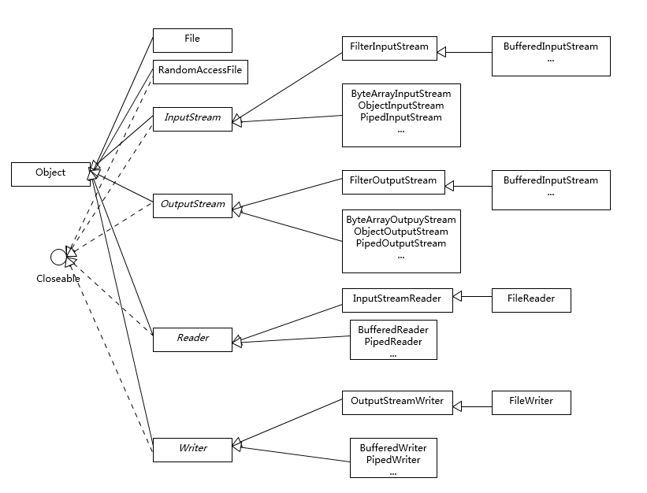

# Java提供了哪些IO方式？ NIO如何实现多路复用？

IO 一直是软件开发中的核心部分之一，伴随着海量数据增长和分布式系统的发展，IO 扩展能力愈发重要。幸运的是，Java 平台 IO 机制经过不断完善，虽然在某些方面仍有不足，但已经在实践中证明了其构建高扩展性应用的能力。

---
## 1 典型回答

Java IO 方式有很多种，基于不同的 IO 抽象模型和交互方式，可以进行简单区分。

**传统IO**：

- 传统的 `java.io` 包，基于流模型实现，提供了我们最熟知的一些 IO 功能，比如 File 抽象、输入输出流等。
- 部分网络 API，比如 `Socket、ServerSocket、HttpURLConnection` 也可以归类到同步阻塞 IO 类库，因为网络通信同样是 IO 行为
- 交互方式是同步、阻塞的方式，也就是说，在读取输入流或者写入输出流时，在读、写动作完成之前，线程会一直阻塞在那里，它们之间的调用是可靠的线性顺序。
- 优点：代码比较简单、直观
- 缺点：IO 效率和扩展性存在局限性，容易成为应用性能的瓶颈。

**NIO**：

- 在 Java 1.4 中引入了 NIO 框架（`java.nio` 包）
- 提供了 Channel、Selector、Buffer 等新的抽象，可以构建多路复用的、同步非阻塞 IO 程序
- 同时提供了更接近操作系统底层的高性能数据操作方式

**NIO 2(AIO)**：

- 在 Java 7 中，NIO 有了进一步的改进，也就是 NIO 2，引入了异步非阻塞 IO 方式，也有很多人叫它 AIO（Asynchronous IO）
- 异步 IO 操作基于事件和回调机制，可以简单理解为，应用操作直接返回，而不会阻塞在那里，当后台处理完成，操作系统会通知相应线程进行后续工作。


---
## 2 考点分析

我上面列出的回答是基于一种常见分类方式，即所谓的 BIO、NIO、NIO 2（AIO）。在实际面试中，从传统 IO 到 NIO、NIO 2，其中有很多地方可以扩展开来，考察点涉及方方面面，比如：

- 基础 API 功能与设计， InputStream/OutputStream 和 Reader/Writer 的关系和区别。
- NIO、NIO 2 的基本组成。
- 给定场景，分别用不同模型实现，分析 BIO、NIO 等模式的设计和实现原理。
- NIO 提供的高性能数据操作方式是基于什么原理，如何使用？
- 从开发者的角度来看，你觉得 NIO 自身实现存在哪些问题？有什么改进的想法吗？

IO 的内容比较多，专栏一讲很难能够说清楚。IO 不仅仅是多路复用，NIO 2 也不仅仅是异步 IO，尤其是数据操作部分，会在专栏下一讲详细分析。

---
## 3 知识扩展

### 同步或异步、阻塞与非阻塞

- 区分同步或异步（synchronous/asynchronous）。简单来说，同步是一种可靠的有序运行机制，当我们进行同步操作时，后续的任务是等待当前调用返回，才会进行下一步；而异步则相反，其他任务不需要等待当前调用返回，通常依靠事件、回调等机制来实现任务间次序关系。
- 区分阻塞与非阻塞（blocking/non-blocking）。在进行阻塞操作时，当前线程会处于阻塞状态，无法从事其他任务，只有当条件就绪才能继续，比如 ServerSocket 新连接建立完毕，或数据读取、写入操作完成；而非阻塞则是不管 IO 操作是否结束，直接返回，相应操作在后台继续处理。
- 同步或异步，阻塞与非阻塞两者本质上并没有关联，它们分别两个不同层次的概念

不能一概而论认为同步或阻塞就是低效，具体还要看应用和系统特征

### 传统 IO

- IO 不仅仅是对文件的操作，网络编程中，比如 Socket 通信，都是典型的 IO 操作目标。
- 输入流、输出流（InputStream/OutputStream）是用于读取或写入字节的，例如操作图片文件。
- Reader/Writer 用于操作字符，增加了字符编解码等功能，适用于类似从文件中读取或者写入文本信息。本质上计算机操作的都是字节，不管是网络通信还是文件读取，Reader/Writer 相当于构建了应用逻辑和原始数据之间的桥梁。
- BufferedOutputStream 等带缓冲区的实现，可以避免频繁的磁盘读写，进而提高 IO 处理效率。这种设计利用了缓冲区，将批量数据进行一次操作，但在使用中千万别忘了 flush。
- 很多 IO 工具类都实现了 Closeable 接口，因为需要进行资源的释放。比如，打开 FileInputStream，它就会获取相应的文件描述符（FileDescriptor），需要利用 `try-with-resources`、 `try-finally` 等机制保证 FileInputStream 被明确关闭，进而相应文件描述符也会失效，否则将导致资源无法被释放。



### NIO 概览

NIO 的主要组成部分：

- Buffer，高效的数据容器，除了布尔类型，所有原始数据类型都有相应的 Buffer 实现。
- Channel，类似在 Linux 之类操作系统上看到的文件描述符，是 NIO 中被用来支持批量式 IO 操作的一种抽象。
File 或者 Socket，通常被认为是比较高层次的抽象，而 Channel 则是更加操作系统底层的一种抽象，这也使得 NIO 得以充分利用现代操作系统底层机制，获得特定场景的性能优化，例如，DMA（Direct Memory Access）等。不同层次的抽象是相互关联的，我们可以通过 Socket 获取 Channel，反之亦然。
- Selector，是 NIO 实现多路复用的基础，它提供了一种高效的机制，可以检测到注册在 Selector 上的多个 Channel 中，是否有 Channel 处于就绪状态，进而实现了单线程对多 Channel 的高效管理。
Selector 同样是基于底层操作系统机制，不同模式、不同版本都存在区别，例如，Linux 上依赖于 epoll、Windows 上 NIO2（AIO）模式则是依赖于 iocp。
- Chartset，提供 Unicode 字符串定义，NIO 也提供了相应的编解码器等，比如 `Charset.defaultCharset().encode("Hello world!"));` 将字符串转换到 ByteBuffer

### NIO 能解决什么问题

#### 没有 NIO 的情况

“一客户一线程”的编程方式如下：

```java
            serverSocket = ...;
            while (true) {
                //阻塞等待连接
                Socket socket = serverSocket.accept();
                RequestHandler requestHandler = new RequestHandler(socket);
                //有一个连接达到，开启线程处理
                requestHandler.start();
            }
```
存在的问题：Java 语言目前的线程实现是比较重量级的，启动或者销毁一个线程是有明显开销的，每个线程都有单独的线程栈等结构，需要占用非常明显的内存，所以，每一个 Client 启动一个线程似乎都有些浪费。

“线程池”的编程方式：通过一个固定大小的线程池，来负责管理工作线程，避免频繁创建、销毁线程的开销，这是我们构建并发服务的典型方式，参考下面代码

```
serverSocket = ...;
executor = Executors.newFixedThreadPool(8);
 while (true) {
    //阻塞等待连接
    Socket socket = serverSocket.accept();
    RequestHandler requestHandler = new RequestHandler(socket);
    //有一个连接达到，提交到线程池处理
    executor.execute(requestHandler);
}
```

存在的问题：

- 如果连接数并不是非常多，只有最多几百个连接的普通应用，这种模式往往可以工作的很好。
- 如果连接数量急剧上升，这种实现方式就无法很好地工作了，因为线程上下文切换开销会在高并发时变得很明显，这是同步阻塞方式的低扩展性劣势。
- 对于连接生存期周期较长的应用协议，线程池的大小仍然限制了系统可以同时的处理客户端数量。

#### NIO 引入的多路复用机制

```java
        //1 通过 Selector.open() 创建一个 Selector，作为类似调度员的角色。
        try (Selector selector = Selector.open();
            //2 创建一个 ServerSocketChannel，绑定到特定端口
            ServerSocketChannel serverSocket = ServerSocketChannel.open();) {// 创建 Selector 和 Channel

            serverSocket.bind(new InetSocketAddress(InetAddress.getLocalHost(), 8888));
            //明确配置为非阻塞模式，
            serverSocket.configureBlocking(false);
            //4 向 Selector 注册，通过指定 SelectionKey.OP_ACCEPT，告诉调度员，它关注的是新的连接请求。
            serverSocket.register(selector, SelectionKey.OP_ACCEPT);
            while (true) {
                //Selector 阻塞在 select 操作，当有 Channel 发生接入请求，就会被唤醒。
                selector.select();// 阻塞等待就绪的 Channel，这是关键点之一，
                Set<SelectionKey> selectedKeys = selector.selectedKeys();
                Iterator<SelectionKey> iter = selectedKeys.iterator();
                while (iter.hasNext()) {
                    SelectionKey key = iter.next();
                   // 生产系统中一般会额外进行就绪状态检查
                    sayHelloWorld((ServerSocketChannel) key.channel());
                    iter.remove();
                }
            }
        } catch (IOException e) {
            e.printStackTrace();
        }

    //通过 SocketChannel 和 Buffer 进行数据操作，发送一段字符串。
     private void sayHelloWorld(ServerSocketChannel server) throws IOException {
        try (SocketChannel client = server.accept();) {
            client.write(Charset.defaultCharset().encode("Hello world!"));
        }
    }
```

对比上面两种 IO 的方式，存在的区别：

- 前面两个样例中，IO 都是同步阻塞模式，所以需要多线程以实现多任务处理
- NIO 利用了单线程轮询事件的机制，通过高效地定位就绪的 Channel，来决定做什么，仅仅 select 阶段是阻塞的，
- 单线程轮询方法可以有效避免大量客户端连接时，频繁线程切换带来的问题，应用的扩展能力有了非常大的提高。

#### NIO 2 的异步 IO 方式

在 Java 7 引入的 NIO 2 中，又增添了一种额外的异步 IO 模式，利用事件和回调，处理 Accept、Read 等操作。

NIO2 编程要素 与 NIO 的对比：

- 基本抽象很相似，AsynchronousServerSocketChannel 对应于 ServerSocketChannel；AsynchronousSocketChannel 则对应 SocketChannel。
- 业务逻辑的关键在于，通过指定 CompletionHandler 回调接口，在 `accept/read/write` 等关键节点，通过事件机制调用，这是非常不同的一种编程思路。


---
## 4 总结与思考题

今天我初步对 Java 提供的 IO 机制进行了介绍，概要地分析了传统同步 IO 和 NIO 的主要组成，并根据典型场景，通过不同的 IO 模式进行了实现与拆解。专栏下一讲，我还将继续分析 Java IO 的主题。关于今天我们讨论的题目你做到心中有数了吗？留一道思考题给你，NIO 多路复用的局限性是什么呢？你遇到过相关的问题吗？

- 从 BIO 过度到 NIO，需要有一个巨大的观念上的转变，要清楚网络就是并非时刻可读可写，我们用 NIO 就是在认真的面对这个问题，别把 channel 当流往死里用，没读出来或写不进去的时候，就是该考虑让度线程资源了

- NIO 在不同的平台上的实现方式是不一样的，如果你工作用电脑是 win，生产是 linux，那么建议直接在 linux 上调试和测试

- NIO 在 IO操 作本身上还是阻塞的，也就是它还是同步 IO，AIO 的回调才是异步 IO

- 使用场景：NIO 请求接受和处理都是一个线程在做。这样的话，如果有多个请求过来都是按顺序处理的，其中一个处理时间比较耗时的话那所有请求还是需要等待？
    - 这种情况需要考虑把耗时操作并发处理，再考虑处理是费 cpu 还是重 io，不同任务需要不同处理；如果耗时操作非常多，就不符合这种模型的适用场景
    
- NIO 不适合数据量太大交互的场景

- 对于多路复用IO，当出现有的IO请求在数据拷贝阶段，会出现由于资源类型过份庞大而导致线程长期阻塞，最后造成性能瓶颈的情况

- java nio的selector主要的问题是效率，当并发连接数达到数万甚至数十万的时候 ，单线程的 selector 会是一个瓶颈
    - nio 的目的是通用场景的基础API，和终端应用有一定距离，核心类库很多都是如此定位，netty 这种开源框架更贴近用户场景
    
- NIO 在线上运行过程中经常出现cpu占用100%的情况，原因也是由于 selector 依赖的操作系统底层机制 bug 导致的 selector 假死，需要程序重建s elector 来解决，这个问题再jdk中似乎并没有很好的解决，netty成为了线上更加可靠的网络框架。不知理解的是否正确，请老师指教？
    - nio 有局限性；那个epoll的bug应该在8里修了，netty的改进不止那些，它为了性能改了很多底层