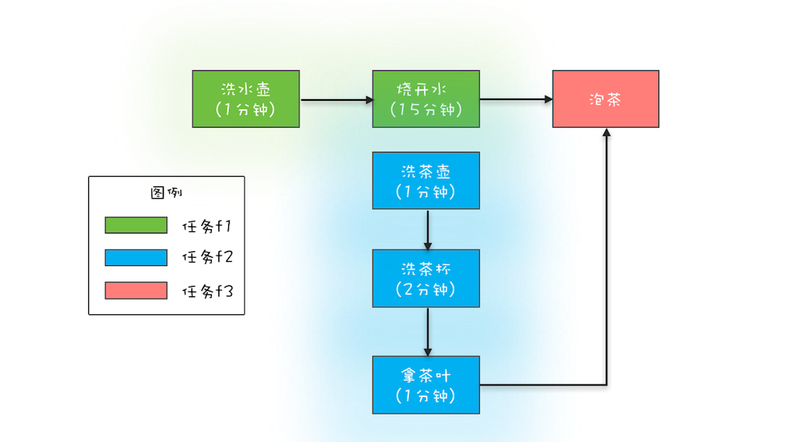

# CompletableFuture

## 1 异步化

用多线程优化性能，其实不过就是将串行操作变成并行操作。而在串行转换成并行的过程中，一定会涉及到异步化：

```java
//并行操作
doBizA();
doBizB();

//串行操作
new Thread(()->doBizA())
  .start();
new Thread(()->doBizB())
  .start();  
```

**异步化，是并行方案得以实施的基础，是利用多线程优化性能这个核心方案得以实施的基础**，Java 在 1.8 版本提供了 CompletableFuture 来支持异步编程。

## 2 引入 CompletableFuture

以烧水泡茶为例，使用 CompletableFuture 来实现：



```java
    private static void getTea() {
        //任务1：洗水壶->烧开水
        CompletableFuture<Void> f1 = CompletableFuture.runAsync(() -> {
            System.out.println("T1:洗水壶...");
            sleep(1, TimeUnit.SECONDS);
            System.out.println("T1:烧开水...");
            sleep(1, TimeUnit.SECONDS);
        });

        //任务2：洗茶壶->洗茶杯->拿茶叶
        CompletableFuture<String> f2 = CompletableFuture.supplyAsync(() -> {
            System.out.println("T2:洗茶壶...");
            sleep(1, TimeUnit.SECONDS);

            System.out.println("T2:洗茶杯...");
            sleep(1, TimeUnit.SECONDS);

            System.out.println("T2:拿茶叶...");
            sleep(1, TimeUnit.SECONDS);
            return "龙井";
        });

        //任务3：任务1和任务2完成后执行：泡茶
        CompletableFuture<String> f3 = f1.thenCombine(f2, (__, tf) -> {
            System.out.println("T1:拿到茶叶:" + tf);
            System.out.println("T1:泡茶...");
            return "上茶:" + tf;
        });

        //等待任务3执行结果
        System.out.println(f3.join());
    }
```

从实现中我们可以看出 CompletableFuture 相比之前的方式有如下特点：

1. 无需手工维护线程，没有繁琐的手工维护线程的工作，给任务分配线程的工作也不需要我们关注。
2. 语义更清晰，例如 `f3 = f1.thenCombine(f2, ()->{})` 能够清晰地表述“任务 3 要等待任务 1 和任务 2 都完成后才能开始”。
3. 代码更简练并且专注于业务逻辑，几乎所有代码都是业务逻辑相关的。

领略 CompletableFuture 异步编程的优势之后，下面我们详细介绍 CompletableFuture 的使用。

## 3 CompletableFuture 详解

### 3.1 创建 CompletableFuture 对象

创建 CompletableFuture 对象主要靠下面代码中展示的这 4 个静态方法：

```java
//使用默认线程池
static CompletableFuture<Void> runAsync(Runnable runnable)
static <U> CompletableFuture<U> supplyAsync(Supplier<U> supplier)

//可以指定线程池  
static CompletableFuture<Void> runAsync(Runnable runnable, Executor executor)
static <U> CompletableFuture<U> supplyAsync(Supplier<U> supplier, Executor executor)  
```

- `runAsync(Runnable runnable)` 和 `supplyAsync(Supplier supplier)`，它们之间的区别是：Runnable 接口的 run() 方法没有返回值，而 Supplier 接口的 get() 方法是有返回值的。
- 前两个方法和后两个方法的区别在于：后两个方法可以指定线程池参数。

#### 线程池

- **默认线程池**：默认情况下 CompletableFuture 会使用公共的 ForkJoinPool 线程池，这个线程池默认创建的线程数是 CPU 的核数（也可以通过 JVM `option:-Djava.util.concurrent.ForkJoinPool.common.parallelism` 来设置 ForkJoinPool 线程池的线程数）。
- **根据不同的业务类型创建不同的线程池，以避免互相干扰**：如果所有 CompletableFuture 共享一个线程池，那么一旦有任务执行一些很慢的 I/O 操作，就会导致线程池中所有线程都阻塞在 I/O 操作上，从而造成线程饥饿，进而影响整个系统的性能。所以最好是根据不同的业务类型创建不同的线程池。

#### 任务是自执行的

创建完 CompletableFuture 对象之后，会自动地异步执行 runnable.run() 方法或者 supplier.get() 方法。

#### CompletableFuture 实现了 Future 与 CompletionStage

实现 Future，解决以下问题：

- 一个是异步操作什么时候结束。
- 一个是如何获取异步操作的执行结果。

而 CompletionStage 用于描述异步任务之间的关系。

### 3.2 CompletionStage

任务是有时序关系的，比如有串行关系、并行关系、汇聚关系等。CompletionStage 接口可以清晰地描述任务之间的这种时序关系以及异步异常处理。

#### 3.2.1 描述串行关系

CompletionStage 接口里面描述串行关系的，主要是下面四个系列的接口：

- thenApply：thenApply 系列函数里参数 fn 的类型是接口 Function，这个接口里与 CompletionStage 相关的方法是 `R apply(T t)`，这个方法既能接收参数也支持返回值，所以 thenApply 系列方法返回的是CompletionStage。
- thenAccept：thenAccept 系列方法里参数 consumer 的类型是接口Consumer，这个接口里与 CompletionStage 相关的方法是 `void accept(T t)`，这个方法虽然支持参数，但却不支持回值，所以 thenAccept 系列方法返回的是CompletionStage。
- thenRun：thenRun 系列方法里 action 的参数是 Runnable，所以 action 既不能接收参数也不支持返回值，所以 thenRun 系列方法返回的也是CompletionStage。
- thenCompose：这个系列的方法会新创建出一个子流程，最终结果和 thenApply 系列是相同的。

这些方法里面 Async 代表的是异步执行 fn、consumer 或者 action。

```java
CompletionStage<R> thenApply(fn);
CompletionStage<R> thenApplyAsync(fn);

CompletionStage<Void> thenAccept(consumer);
CompletionStage<Void> thenAcceptAsync(consumer);

CompletionStage<Void> thenRun(action);
CompletionStage<Void> thenRunAsync(action);

CompletionStage<R> thenCompose(fn);
CompletionStage<R> thenComposeAsync(fn);
```

示例：首先通过 supplyAsync() 启动一个异步流程，之后是两个串行操作

```java
CompletableFuture<String> f0 =
        CompletableFuture.supplyAsync(() -> "Hello World")//①
                .thenApply(s -> s + " QQ")//②
                .thenApply(String::toUpperCase);//③

System.out.println(f0.join());

//输出结果
HELLO WORLD QQ
```

虽然这是一个异步流程，但任务①②③却是串行执行的，②依赖①的执行结果，③依赖②的执行结果。

#### 3.2.2 描述聚合关系

汇聚关系分为 AND 聚合关系和 OR 聚合关系

- AND 聚合关系：上面提到的 `f3 = f1.thenCombine(f2, ()->{})` 描述的就是一种 AND 汇聚关系，所有依赖的任务都完成后才开始执行当前任务。
- OR 聚合关系：依赖的任务只要有一个完成就可以执行当前任务。

##### AND 聚合关系

CompletionStage 接口里面描述 AND 汇聚关系，主要是 thenCombine、thenAcceptBoth 和 runAfterBoth 系列的接口，这些接口的区别也是源自 fn、consumer、action 这三个核心参数不同。它们的使用你可以参考上面烧水泡茶的实现程序，这里就不赘述了。

```java
CompletionStage<R> thenCombine(other, fn);
CompletionStage<R> thenCombineAsync(other, fn);
CompletionStage<Void> thenAcceptBoth(other, consumer);
CompletionStage<Void> thenAcceptBothAsync(other, consumer);
CompletionStage<Void> runAfterBoth(other, action);
CompletionStage<Void> runAfterBothAsync(other, action);
```

##### OR 聚合关系

CompletionStage 接口里面描述 OR 汇聚关系，主要是 applyToEither、acceptEither 和 runAfterEither 系列的接口，这些接口的区别也是源自 fn、consumer、action 这三个核心参数不同。

```java
CompletionStage applyToEither(other, fn);
CompletionStage applyToEitherAsync(other, fn);
CompletionStage acceptEither(other, consumer);
CompletionStage acceptEitherAsync(other, consumer);
CompletionStage runAfterEither(other, action);
CompletionStage runAfterEitherAsync(other, action);
```

示例代码展示了如何使用 applyToEither() 方法来描述一个 OR 汇聚关系：

```java
CompletableFuture<String> f1 =
        CompletableFuture.supplyAsync(() -> {
            int t = getRandom(5, 10);
            sleep(t, TimeUnit.SECONDS);
            return String.valueOf(t);
        });

CompletableFuture<String> f2 =
        CompletableFuture.supplyAsync(() -> {
            int t = getRandom(5, 10);
            sleep(t, TimeUnit.SECONDS);
            return String.valueOf(t);
        });

CompletableFuture<String> f3 = f1.applyToEither(f2, s -> s);

System.out.println(f3.join());
```

#### 3.2.3 异常处理

上面提到的 fn、consumer、action 它们的核心方法都不允许抛出可检查异常，但是却无法限制它们抛出运行时异常。对异常处理：

- 对于非异步编程：可以使用 `try{}catch{}` 来捕获并处理异常
- 对于异步编程：CompletionStage 提供了统一的异常处理接口，使用上比 `try{}catch{}` 还要简单。

```java
CompletionStage exceptionally(fn);
CompletionStage<R> whenComplete(consumer);
CompletionStage<R> whenCompleteAsync(consumer);
CompletionStage<R> handle(fn);
CompletionStage<R> handleAsync(fn);
```

下面的示例代码展示了如何使用 exceptionally() 方法来处理异常

```cpp
CompletableFuture<Integer>
        f0 = CompletableFuture
        .supplyAsync(() -> 7 / 0)
        .thenApply(r -> r * 10)
        .exceptionally(e -> 0);

//输出 0
System.out.println(f0.join());
```

- exceptionally() 的使用非常类似于 `try{}catch{}` 中的 `catch{}`。
- whenComplete() 和 handle() 系列方法就类似于 `try{}finally{}` 中的 `finally{}`，无论是否发生异常都会执行 whenComplete() 中的回调函数 consumer 和 handle() 中的回调函数 fn。whenComplete() 和 handle() 的区别在于 whenComplete() 不支持返回结果，而 handle() 是支持返回结果的

## 4 总结

回调地狱（Callback Hell）让异步编程声名狼藉，后续发展处了很多异步框架用于处理异步编程。

- Java 语言在 1.8 版本提供了 CompletableFuture，在 Java 9 版本则提供了更加完备的 Flow API，异步编程目前已经完全工业化。因此，学好异步编程还是很有必要的。
- [ReactiveX](http://reactivex.io/intro.html) 项目（Java 语言的实现版本是 RxJava）也是异步编程的解决方案，利用 RxJava，即便在 Java 1.6 版本也能享受异步编程的乐趣。

## 5 思考题

创建采购订单的时候，需要校验一些规则，例如最大金额是和采购员级别相关的。有同学利用 CompletableFuture 实现了这个校验的功能，逻辑很简单，首先是从数据库中把相关规则查出来，然后执行规则校验。你觉得他的实现是否有问题呢？

```java
//采购订单
PurchersOrder po;
CompletableFuture<Boolean> cf = CompletableFuture.supplyAsync(()->{
                                //在数据库中查询规则
                                return findRuleByJdbc();
                            }).thenApply(r -> {
                                //规则校验
                                return check(po, r);
                            });
Boolean isOk = cf.join();
```

1. 没有做异常处理。
2. 数据库查询属于 IO，应该指定专门的 IO 线程池。
3. 如果查询和对比操作比较耗时，采用生产者和消费者模式，让上一次的检查和下一次的查询并行起来。

## 6 参考

- [Java 8 CompletableFuture 教程](https://juejin.im/post/5adbf8226fb9a07aac240a67)
- [20个使用 Java CompletableFuture的例子](https://colobu.com/2018/03/12/20-Examples-of-Using-Java%E2%80%99s-CompletableFuture/)
