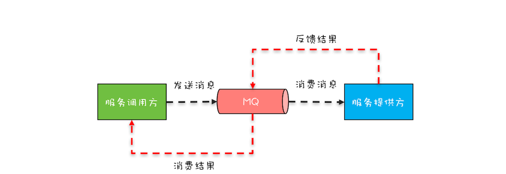
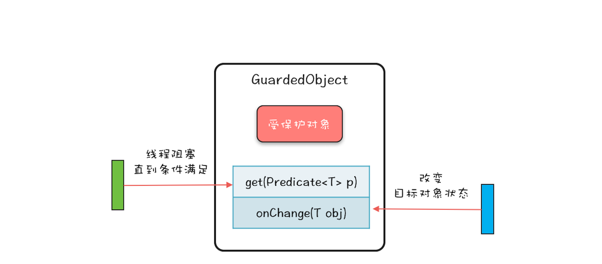

# 并发设计模式：保护性暂停

## 1 需求：Web 版的文件浏览器

一个 Web 版的文件浏览器，通过它用户可以在浏览器里查看服务器上的目录和文件。这个项目依赖运维部门提供的文件浏览服务，而这个文件浏览服务只支持消息队列（MQ）方式接入。

分析：

发送消息和消费结果这两个操作之间是异步的，如何在发送消息后将后续结果返回给调用方？



```java
class Message{
  String id;
  String content;
}

//该方法可以发送消息
void send(Message msg){
  //省略相关代码
}

//MQ消息返回后会调用该方法
//该方法的执行线程不同于
//发送消息的线程
void onMessage(Message msg){
  //省略相关代码
}

//处理浏览器发来的请求
Respond handleWebReq(){
  //创建一消息
  Message msg1 = new 
    Message("1","{...}");
  //发送消息
  send(msg1);
  //如何等待MQ返回的消息呢？
  String result = ...;
}
```

## 2 Guarded Suspension 模式

问题类比：项目组团建要外出聚餐，提前预订了一个包间，出发到那儿后大堂经理看了一眼包间，发现服务员正在收拾，就会告诉我们：“您预订的包间服务员正在收拾，请您稍等片刻。”过了一会，大堂经理发现包间已经收拾完了，于是马上带我们去包间就餐。

这类问题的本质是**等待一个条件满足**，我们在程序设计上也可以实现一个大堂经理来协调任务的等待与通知，而针对这一类需要进行等待条件满足的场景，前人已经总结了出了 Guarded Suspension 模式，所谓 Guarded Suspension，直译过来就是“保护性地暂停”。

Guarded Suspension 模式的结构图：



其包括：一个对象 GuardedObject，内部有一个成员变量（受保护的对象），以及两个成员方法——`get(Predicate p`)和`onChanged(T obj)`方法。对应关系为：

1. 对象 GuardedObject 担任大堂经理的角色。
2. 受保护对象就是餐厅里面的包间。
3. 受保护对象的 `get()` 方法对应的就餐，而就餐的条件是包间已经收拾好，参数 p 用来描述这个条件。
4. 受保护对象的 `onChanged()` 方法对应的是服务员把包间收拾好了，通过 `onChanged()` 方法可以 fire 一个事件，而这个事件往往能改变前提条件 p 的计算结果

利用管程实现 Guarded Suspension：

```java
/**
 *  GuardedObject 是一个通用的 Guarded Suspension 实现
 */
class GuardedObject<T>{

  //受保护的对象
  T obj;

  final Lock lock = new ReentrantLock();

  final Condition done = lock.newCondition();

  final int timeout = 1;

  //获取受保护对象  
  T get(Predicate<T> p) {
    lock.lock();
    try {
      //MESA管程推荐写法
      while(!p.test(obj)){
        done.await(timeout, TimeUnit.SECONDS);
      }
    }catch(InterruptedException e){
      throw new RuntimeException(e);
    }finally{
      lock.unlock();
    }
    //返回非空的受保护对象
    return obj;
  }

  //事件通知方法
  void onChanged(T obj) {
    lock.lock();
    try {
      this.obj = obj;
      done.signalAll();
    } finally {
      lock.unlock();
    }
  }

}
```

## 3 扩展 Guarded Suspension 模式

将 Guarded Suspension 模式应用到 `Web 版的文件浏览器` 中：

1. 在处理 Web 请求的方法 handleWebReq() 中，可以调用 GuardedObject 的 get() 方法来实现等待。
2. 在 MQ 消息的消费方法 onMessage() 中，可以调用 GuardedObject 的 onChanged() 方法来实现唤醒。

```java
//处理浏览器发来的请求
Respond handleWebReq(){
  //创建一消息
  Message msg1 = new Message("1","{...}");
  //发送消息
  send(msg1);
  //利用GuardedObject实现等待
  GuardedObject<Message> go = new GuardObjec<>();
  Message r = go.get(t->t != null);
}

void onMessage(Message msg){
  //如何找到匹配的go？
  GuardedObject<Message> go=???
  go.onChanged(msg);
}
```

遇到的问题是：handleWebReq() 里面创建了 GuardedObject 对象的实例 go，并调用其 get() 方等待结果，那在 onMessage() 方法中，如何才能够找到匹配的 GuardedObject 对象？对此我们可以扩展一下 Guarded Suspension 模式， `Web 版的文件浏览器` 中，每个发送到 MQ 的消息，都有一个唯一性的属性 id，所以我们可以维护一个 MQ 消息 id 和 GuardedObject 对象实例的关系：

```java
class GuardedObject<T>{

  //受保护的对象
  T obj;

  final Lock lock = new ReentrantLock();
  final Condition done = lock.newCondition();

  final int timeout=2;

  //保存所有GuardedObject
  final static Map<Object, GuardedObject> gos=new ConcurrentHashMap<>();

  //静态方法创建GuardedObject
  static <K> GuardedObject create(K key){
    GuardedObject go=new GuardedObject();
    gos.put(key, go);
    return go;
  }

  static <K, T> void fireEvent(K key, T obj){
    GuardedObject go=gos.remove(key);
    if (go != null){
      go.onChanged(obj);
    }
  }

  //获取受保护对象  
  T get(Predicate<T> p) {
    lock.lock();
    try {
      //MESA管程推荐写法
      while(!p.test(obj)){
        done.await(timeout,TimeUnit.SECONDS);
      }
    }catch(InterruptedException e){
      throw new RuntimeException(e);
    }finally{
      lock.unlock();
    }
    //返回非空的受保护对象
    return obj;
  }

  //事件通知方法
  void onChanged(T obj) {
    lock.lock();
    try {
      this.obj = obj;
      done.signalAll();
    } finally {
      lock.unlock();
    }
  }
}
```

>上面实现还差一些问题，如果有方法调用了 GuardedObect.create 方法，但是没有任何其他线程调用 fireEvent 方法会造成内存泄漏，所以等待超时后要把 GuardedObject 从 map 中移除。

使用扩展后的

```java
//处理浏览器发来的请求
Respond handleWebReq(){
  int id=序号生成器.get();
  //创建一消息
  Message msg1 = new Message(id,"{...}");
  //创建GuardedObject实例
  GuardedObject<Message> go = GuardedObject.create(id);  
  //发送消息
  send(msg1);
  //等待MQ消息
  Message r = go.get(t->t != null);  
}

void onMessage(Message msg){
  //唤醒等待的线程
  GuardedObject.fireEvent(msg.id, msg);
}
```

## 4 总结

1. Guarded Suspension 模式本质上是一种等待唤醒机制的实现，只不过 Guarded Suspension 模式将其规范化了。规范化的好处是你无需重头思考如何实现，也无需担心实现程序的可理解性问题，同时也能避免一不小心写出个 Bug 来。
2. Guarded Suspension 模式在解决实际问题的时候，往往还是需要扩展的，这个需要根据具体场景具体分析。

Guarded Suspension 模式也常被称作 Guarded Wait 模式、Spin Lock 模式（因为使用了 while 循环去等待），其还有一个更形象的名词：**多线程版本的 if**。

## 5 思考题

有同学觉得用 done.await() 还要加锁，太啰嗦，还不如直接使用 sleep() 方法，下面是他的实现，你觉得他的写法正确吗？

```java
//获取受保护对象  
T get(Predicate<T> p) {
  try {
    while(!p.test(obj)){
      TimeUnit.SECONDS.sleep(timeout);
    }
  }catch(InterruptedException e){
    throw new RuntimeException(e);
  }
  //返回非空的受保护对象
  return obj;
}

//事件通知方法
void onChanged(T obj) {
  this.obj = obj;
}
```

1. timeout 时间无法确定，控制不好容易导致更多的上下文切换。
2. 条件完成时无法即时地通知到。
3. 当从消息队列接收消息失败时，while 循环会一直执行下去，永远不会结束，回占用大量资源。
4. 没有锁也无法保证内存可见性。
