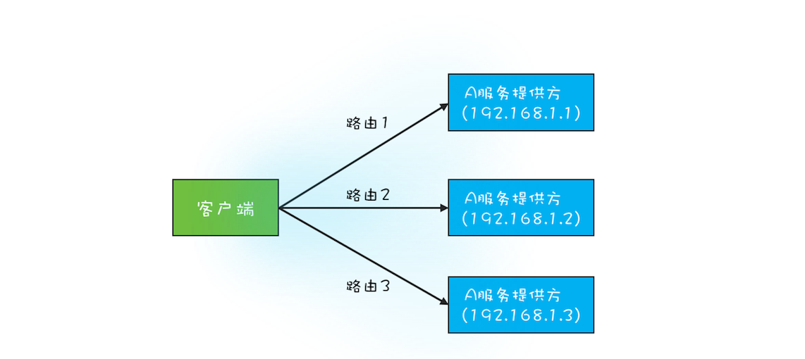
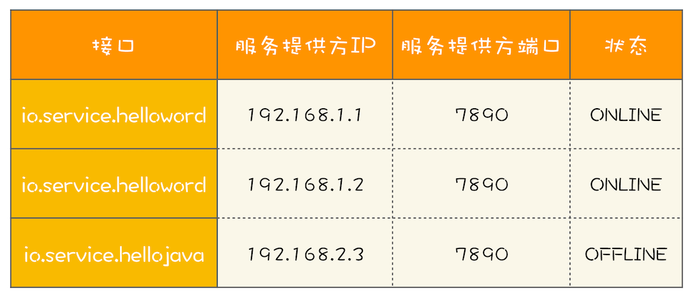

# 并发设计模式：Cop-on-Write

## 1 理解 Cop-on-Write

Cop-on-Write 即写时复制，简写为 COW 或 CoW，应用范围比较广，比如：

1. Java 里 String 这个类在实现 `replace()` 方法的时候，并没有更改原字符串里面 `value[]` 数组的内容，而是创建了一个新字符串，本质上也是一种 CoW，使用 Cow 实现 Immutability 模式。
2. Linux 操作系统中创建进程的 API 是 fork()，这个 fork 操作其实也使用了 Cow，刚 fork 出来的子进程并不复制整个父进程的地址空间，而是让父子进程共享同一个地址空间；只用在父进程或者子进程需要写入的时候才会复制地址空间，从而使父子进程拥有各自的地址空间。
3. Btrfs (B-Tree File System)、aufs（advanced multi-layered unification filesystem）也使用了 Cow。
4. Docker 容器镜像的设计是 Copy-on-Write，分布式源码管理系统 Git 背后的设计思想都有 Copy-on-Write。

Linux 中的 fork 函数，还实现了按需复制，从而提升了操作系统的性能，这里体现的是**延时策略，只有在真正需要复制的时候才复制，而不是提前复制好**。而 Java 提供的 Copy-on-Write 容器，由于在修改的同时会复制整个容器，所以在提升读操作性能的同时，是以内存复制为代价的。可以看出，**同样是应用 Copy-on-Write，不同的场景，侧重点不同，对性能的影响也是不同的**。

**Copy-on-Write 最大的应用领域在函数式编程领域**：函数式编程的基础是不可变性（Immutability），所以函数式编程里面所有的修改操作都需要 Copy-on-Write 来解决。如果在函数式编程领域中实现数据的按需复制，还可以降低性能消耗。具体可以参考 Purely Functional Data Structures 里面描述了各种具备不变性的数据结构的实现。

JDK 中的 CopyOnWriteArrayList 和 CopyOnWriteArraySet 这两个 Copy-on-Write 容器，通过 Copy-on-Write 实现的读操作是无锁的，由于无锁，所以将读操作的性能发挥到了极致，但是在修改的时候会复制整个数组，所以如果容器经常被修改或者这个数组本身就非常大的时候，是不建议使用的。反之，如果是修改非常少、数组数量也不大，并且对读性能要求苛刻的场景，使用 Copy-on-Write 容器效果会比较理想。

## 2 Cop-on-Write 使用案例

**需求**：

1. 实现一个 RPC 框架，服务提供方是多实例分布式部署的，所以服务的客户端在调用 RPC 的时候，需要选定一个服务实例来调用，这个选定的过程本质上就是在做负载均衡。
2. **负载均衡**：负载均衡的前提是客户端要有全部的服务提供商的路由信息。
3. RPC 框架的一个核心任务就是维护服务的路由关系，可以把服务的路由关系简化成下图所示的路由表。当服务提供方上线或者下线的时候，就需要更新客户端的这张路由表。

**分析**：

1. 每次 RPC 调用都需要通过负载均衡器来计算目标服务的 IP 和端口号，而负载均衡器需要通过路由表获取接口的所有路由信息，即每次 RPC 调用都需要访问路由表，所以访问路由表这个操作的性能要求很高。
2. 路由表对数据的一致性要求并不高，一个服务提供方从上线到反馈到客户端的路由表里，即便有 5 秒钟，很多时候也都是能接受的。
3. 服务提供方不会频繁地上线下线，所以路由表是典型的读多写少类问题，写操作的量相比于读操作是少得可怜的。

综上所述：**对读的性能要求很高，读多写少，弱一致性**，使用 Cow 正好符合这种需求。所以可以用 `ConcurrentHashMap<String, CopyOnWriteArraySet<Router>>` 来描述路由表。其次服务提供方的每一次上线、下线都会更新路由信息，可以采用 Immutability 模式，每次上线、下线都创建新的 Router 对象或者删除对应的 Router 对象。由于上线、下线的频率很低，所以对性能的影响小。

```java
//路由信息
public final class Router{

  private final String  ip;
  private final Integer port;
  private final String  iface;

  //构造函数
  public Router(String ip, Integer port, String iface){
    this.ip = ip;
    this.port = port;
    this.iface = iface;
  }

  //重写equals方法
  public boolean equals(Object obj){
    if (obj instanceof Router) {
      Router r = (Router)obj;
      return iface.equals(r.iface) && ip.equals(r.ip) && port.equals(r.port);
    }
    return false;
  }

  public int hashCode() {
    //省略hashCode相关代码
  }

}

//路由表信息
public class RouterTable {
  //Key:接口名
  //Value:路由集合
  ConcurrentHashMap<String, CopyOnWriteArraySet<Router>> rt = new ConcurrentHashMap<>();

  //根据接口名获取路由表
  public Set<Router> get(String iface){
    return rt.get(iface);
  }

  //删除路由
  public void remove(Router router) {
    Set<Router> set=rt.get(router.iface);
    if (set != null) {
      set.remove(router);
    }
  }

  //增加路由
  public void add(Router router) {
    Set<Router> set = rt.computeIfAbsent(route.iface, r ->  new CopyOnWriteArraySet<>());
    set.add(router);
  }
}
```

## 3 总结

Copy-on-Write 是一项非常通用的技术方案，在很多领域都有着广泛的应用。不过，它也有缺点的，那就是**消耗内存，每次修改都需要复制一个新的对象出来**，好在随着自动垃圾回收（GC）算法的成熟以及硬件的发展，这种内存消耗已经渐渐可以接受了。所以在实际工作中，如果写操作非常少，那你就可以尝试用一下 Copy-on-Write。另外有一点需要注意的是 **CopyOnWrite 容器在使用上有数据不完整的时间窗口**，在使用时也需要考虑到这一点。

## 4 思考题

Java 提供了 CopyOnWriteArrayList，为什么没有提供 CopyOnWriteLinkedList 呢？

1. ArrayList 是用是数组实现的，在内存上时一块连续的区域，拷贝时效率比较高，时间复杂度为 `O(1)`。
2. LinkedList 是链表实现，其数据是通过指针串联起来的，并非一块连续的区域，拷贝时必须要进行遍历操作，效率比较低， 时间复杂度是 `O(n)`。

参考 CopyOnWriteArrayList 的 add 函数，Arrays.copyOf 最终调用的是 System.arraycopy 方法：

```java
    public boolean add(E e) {
        final ReentrantLock lock = this.lock;
        lock.lock();
        try {
            Object[] elements = getArray();
            int len = elements.length;
            Object[] newElements = Arrays.copyOf(elements, len + 1);
            newElements[len] = e;
            setArray(newElements);
            return true;
        } finally {
            lock.unlock();
        }
    }
```
