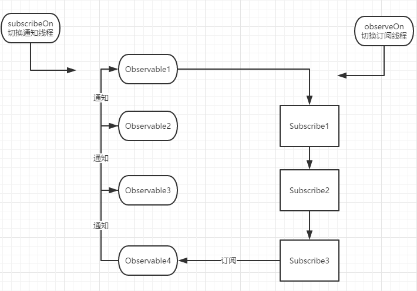

# RxJava 线程切换操作符

## 1 RxJava线程切换

RxJava之所以这么强大，很大一部分原因就是它可以随意的切换线程， RxJava 默认支持的线程调度器：

| 调度器类型 | 效果 |
| --- | --- |
| Schedulers.computation() | 用于计算任务，默认线程数等于处理器的数量 |
| Schedulers.from(executor) | 使用指定的Executor作为调度器 |
| Schedulers.immediate() | 在当前线程立即开始执行任务 |
| Schedulers.io() | 用于IO密集型任务，如异步阻塞IO操作， 默认是一个CachedThreadScheduler |
| Schedulers.newThread() | 为每个任务创建一个新线程 |
| Schedulers.trampoline() | 当其它排队的任务完成后，在当前线程排队开始执行 |
| AndroidSchedulers.mainThread() | Android特有的调度器，用于切换到主线程 |
| HandlerScheduler| Android特有的调度器，用于指定在特定handler线程执行 |

我们可以看到 Schedules 除了提供一些特定的调度器之外，还可以通过 from从Executor 创建一个自定义的调度器。

```java
            //根据cpu的核心数量来创建一个调度器。
            int nThreads = Runtime.getRuntime().availableProcessors();
            System.out.println(nThreads);
            rx.Scheduler from = Schedulers.from(Executors.newFixedThreadPool(nThreads));
```

## 2 有关线程调度器的切换

主要方法有两个：

- subscribeOn：用于切换Observable往回通知的线程调度器，也指定了被观察的执行线程。
- observeOn：用于切换**观察者**对数据操作的线程调度器，指定了**观察者**的执行线程。

如下图所示：



关于线程切换的代码示例：

```java
            rx.Scheduler jobScheduler = Schedulers.from(Executors.newFixedThreadPool(4));

            Observable.just("1")
                    .doOnSubscribe(new Action0() {//doOnSubscribe表示当发生订阅时的动作，它受它代码上的下一个最近的subscribeOn影响，这里他执行在computation
                        @Override
                        public void call() {
                            method4();
                        }
                    })
                    .subscribeOn(Schedulers.computation())//指定了被观察者的执行线程，computation
                    .map(new Func1<String, String>() {//由于没有指定，所以这个map还是执行在上一个subscribeOn指定的线程computation
                        @Override
                        public String call(String s) {
                            return method1();
                        }
                    })
                    .observeOn(Schedulers.newThread())//指定观察者的执行线程
                    .map(new Func1<String, String>() {//它在上一个observeOn指定的线程执行，也就是newThread
                        @Override
                        public String call(String s) {
                            return method2();
                        }
                    })
                    .observeOn(jobScheduler)//这里还是执行在它之后的观察者执行的线程
                    .subscribe(new Action1<String>() {
                        @Override
                        public void call(String s) {
                            //执行在jobScheduler指定的线程
                        }
                    });
```

## 3 发生订阅时的回调

- Subscribe的onStart方法在它订阅Observable的那一刻起就立即被调用，无法用observeOn来切换
- doOnSubscribe是一个操作符，可以指定一个动作，它表示某一个Observbale被订阅后要执行的动作，可以用它**链式代码上之后的subscribeOn**执指定执行线程。