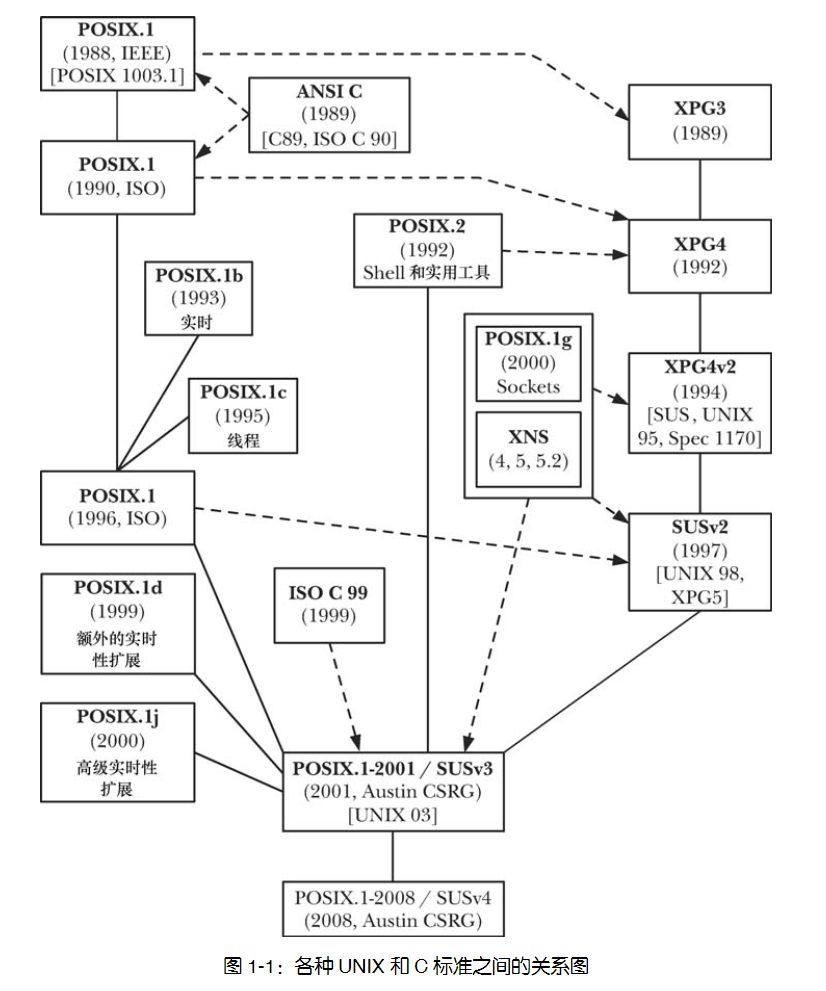

# 一、历史和标准

>Linux 编程接口：运行于 Linux 之上的每一个程序都会直接或间接地使用这些接口。这些接口允许应用程序去执行诸多任务：`文件I/O、创建/删除文件和目录、创建新进程、执行程序、设置定时器、在同一台计算机上发起进程或线程间通信，以及为联网计算机间的进程建立通信`等等。有时，人们也将这一系列的底层接口称为**系统编程接口**。

- 成就今日 Linux 系统的两大关键因素：GNU 项目 和 Linux内核的开发。
- 对 UNIX 的两种定义
  - 其一是指通过 SUS 所规范的官方一致性测试，且由OPEN  GROUP（UNIX商标的持有者）正式授权冠以“UNIX”的操作系统。
  - 第二种定义中，UNIX 是指那种运作方式类似于经典 UNIX 系统（比如，最初的Bell实验室UNIX系统，及其后来的主要分支System V和BSD）的操作系统。根据这一定义，一般将Linux视为UNIX系统。

## 1 UNIX 和 C 语言简史

- 1969年，在 bell 实验室中，Ken Thompson 开发出了首个 UNIX 实现（此时还是汇编实现的）。
- 1970年，Dennis  Ritchie（Thompson 在 bell 实验室的同事，UNIX 开发的早期合作者）设计并实现出了 C 编程语言。
- 1973年，C 语言步入了成熟期，人们能够使用这一新语言重写几乎整个 UNIX 内核。UNIX 因此也一变而为最早以高级语言开发而成的操作系统之一，这也促成了 UNIX 系统后续向其他硬件架构的移植。

从C语言的起源不难看出为什么C语言及其“后裔”C++是当今使用最为广泛的系统编程语言。

- 1979年1月的UNIX第七版，处理可靠性的提高，第七版 UNIX 发布的重要意义还在于，从该版本起，UNIX 分裂为了两大分支：BSD 和System V。
  - BSD：BSD（伯克利软件发布，Berkeley Software Distribution）的UNIX版本
  - System III 由 AT& T 所属的 UNIX 支撑团队（UNIX Support Group，USG）研发

## 2 Linux 历史：Linux 内核与 GUN 项目

术语 Linux 通常用来指代完整的类 UNIX（UNIX-like）操作系统，Linux 内核只是其中的一部分，另外一个重要的部分是 GUN 项目。

- 了解 Richard Stallman 发起 GNU 项目（“GNU’s not UNIX”的递归缩写形式）的目的与现状。
- 了解 GNU GPL（通用公共许可协议）。
- 作为 GUN 项目的最重要一个环节——Unix内核，HURD 目前还在开发中。
- GNU/Linux 称呼由来：Linux 系统有相当一部分都源自 GNU 项目。
- 了解 Linus Torvalds 开发和公布 Linux 内核的历史。

## 3 Linux 内核版本号

内核开发者针对每次发布所采用的内核版本编号方案为 `x.y.z`。

- x 表示主版本号。
- y 为附属于主版本号的次版本号。
- z 是从属于次版本号的修订版本号（细微的改进和BUG修复）。

### 早期的发布模式

采用这一发布模式，内核的两个版本会一直处于开发之中。

- 一个是用于生产系统的稳定（stable）分支，其次版本号为偶数；
- 另一个是经常变动的开发（development）分支，其次版本号为奇数（当前稳定版次版本号+1）。

比如：内核开发分支 `2.3.z` 会“进化”为内核稳定分支 `2.4`。

### 新的的发布模式

随着 `2.6` 内核的发布，内核开发模式再次发生改变。

- 不再有稳定内核和开发内核的概念。每个新的 2.6.z 发布版都可以包含新特性，其生命周期始于对新特性的追加，然后历经一系列候选发布版本让新特性稳定下来。当开发者认为某个候选版本足够稳定时，便可将其作为内核2.6.z发布。一般情况下，发布周期约为3个月。
- 有时，也可能需要为某个稳定的2.6.z发布版打上些小补丁程序，以修复bug或安全问题。如果这样的修复工作具有足够高的优先级，并且补丁程序的正确性也“毋庸置疑”，那么无需等待下一个2.6.z发布版，可以直接应用补丁创建一个版本号形如2.6.z.r的发布版本，其中，r作为该2.6.z内核版本的次修订版序号。
- 额外责任将转嫁给 Linux 发行厂商，由他们来确保随 Linux 发行版一同发行内核的稳定性。

## 4 Linux 发行版

**术语 Linux**：只是指由 Linus Torvalds 和其他人所开发出的内核。但是也常使用该术语来指代内核外加一大堆其他软件（工具和库）所构成的完整操作系统。

**为什么会有Linux发行版**？Linux草创之际，需要用户自行组装上述所有软件，创建文件系统，在文件系统上正确地安置并配置所有软件。用户不但要具备专业知识，还需为此耗费大量时间。如此一来，这便为 Linux 发行商们开启了市场，他们创建软件包（发行版），来自动完成大部分安装过程，其中包括了建立文件系统以及安装内核和其他所需软件等。

**目前有哪些 Linux 发行版**？

- Debian
- SUSE
- Red Hat
- Ubuntu
- fedora
- ... 等等

## 5 标准化

### 5.1 为什么需要标准

20世纪80年代末，可用的UNIX实现层出不穷，由此也带来了种种弊端：20世纪80年代末，可用的UNIX实现层出不穷，由此也带来了种种弊端。有些UNIX实现基于BSD，而另一些则基于System V，还有一些则是对两大“流派”“兼容并蓄”。甚至每个厂商都在自己的UNIX实现中添加了额外特性。**其结果是将软件及技术人员在不同UNIX实现间转移就变得异常困难**。

在这种形式有力地推动了C语言和UNIX系统的标准化进程，使得应用程序能够在不同操作系统间很方便地进行移植。

### 5.2 C 语言标准

1. 1989年：**C89**，ANSI（美国国家标准委员会）C 语言标准（X3.159-1989）最终于 1989 年获批，Kernighan 和  Ritchie所著的 《The  C  Programming  Language》第2版（1988）对其有完整描述。ANSI C 通常指 C89。
2. 1990年：**C89** 被 ISO （国际标准化组织）所采纳，因此 C89 也叫 ISO C90。
3. 1999年，ISO 又正式批准了对C语言标准的修订版，通常将这一标准称为[**C99**](http://www.open-std.org/jtc1/sc22/wg14/www/standards)。

### 5.3 POSIX 标准

什么是 POSIX

- POSIX 是可移植操作系统Portable Operating System Interface的缩写。
- POSIX 是由IEEE（电器及电子工程师协会）下属的可移植应用标准委员会（PASC, <http://www.pasc.org/>）赞助下所开发的一系列标准。
- PA S C标准的目标是提升应用程序在源码级别的可移植性。

POSIX.1：

- POSIX.1 于 1989 年成为IEEE标准，并在稍作修订后于1990年被正式采纳为ISO标准。（无法在线获得这一POSIX标准，但能从IEEE（<http://www.ieee.org/）购得）>
- 符合POSIX.1标准的操作系统应向程序提供调用各项服务的API，POSIX.1文档对此作了规范。凡是提供了上述API的操作系统都可被认定为符合POSIX.1标准。
- POSIX.1基于UNIX系统调用和C语言库函数，但无需与任何特殊实现相关。这意味着任何操作系统都可以实现该接口，而不一定要是UNIX操作系统。

POSIX.2：

- 与POSIX.1相关的标准，对shell和包括C编译器命令行接口在内的各种UNIX工具进行了标准化。

### 5.4 X/Open 公司和 The Open Group

X/Open 公司：

- X/Open公司是由多家国际计算机厂商所组成的联盟，致力于采纳和改进现有标准，以制定出一套全面而又一致的开放系统标准。
- X/Open公司编纂的《X/Open 可移植性指南》是一套基于 POSIX 标准的可移植性指导丛书。
- 《X/Open 可移植性指南》的首个重要版本是1989年发布的第三号（XPG3）
- XPG4随之于1992年发布。1994年，X/Open又对XPG4做了修订，从而诞生了XPG4版本2

SUS（Single UNIX Specification）：

- 1993年初，Novell从 AT&T 收购了UNIX系统的相关业务，又在稍后放弃了这项业务，并将UNIX商标权转让给了 X/Open。
- X/Open 将 XPG4 版本2“重新包装”为 SUS（Single UNIX Specification）（有时，也叫 SUSv1）或称之为 UNIX95。
- [SUSv2](http://www.unix.org/version2/online.html)发布于1997年，人们将经过该规范认证的UNIX实现称为UNIX 98。该规范也被称之为XPG5。

The Open Group：

- 1996年，X/Open与开放软件基金会（OSF）合并，成立The Open Group。
- 如今，几乎每家与UNIX系统有关的公司或组织都是The Open Group的会员，该组织持续着对API标准的开发。

### 5.5 SUSv3 和 POSIX.1-2001

**奥斯丁公共标准修订工作组和 SUSv3**：

- 1999 年，出于修订并加强 POSIX 标准和 SUS 规范的目的，IEEE、Open 集团以及 ISO/IEC 联合技术委员会共同成立了奥斯丁公共标准修订工作组（[CSRG](http://www.opengroup.org/austin/)）
- 2001 年 12 月，该工作组正式批准了 POSIX 1003.1-2001，有时简称为 POSIX.1-2001（随后，又获批为 ISO 标准：ISO/IEC 9945:2002）
- POSIX 1003.1-2001 取代了SUSv2、POSIX.1、POSIX.2 以及大批的早期 POSIX 标准。有时，人们也将该标准称为 Single Unix Specification 版本 3，SUSv3
- SUSv3 规范可在线获得，网址是<http://www.unix.org/version3/online.html>。通过 SUSv3 认证的 UNIX 实现可被称为 UNIX 03。
- 自 SUSv3 获批以来，人们针对规范文本中所发现的问题进行了多次小规模的修复和改进。

#### 符合 POSIX、XSI 规范和 XSI 扩展

SUS（和XPG）标准顺应了相应 POSIX 标准，并被组织为 POSIX 的功能超集。除了对许多额外接口作出规范外，SUS标准还将诸多被 POSIX 视为可选的接口和行为规范作为必备项，该文档定义了对规范的两级符合度。

- POSIX 规范符合度，就符合该规范的UNIX实现所必须提供的接口定义了基线。规范允许符合度达标的 UNIX 实现提供其他可选接口。
- XSI（X/Open系统接口 [X/Open System Interface]）规范符合度，对UNIX实现来说，要想完全符合 XSI 规范，除了必须满足POSIX规范的所有规定之外，还要提供若干 POSIX 规范中的可选接口和行为。只有这一规范符合度达标，才能从 OPEN GROUP 获得 UNIX03 称号。

人们将 XSI 规范符合度达标所需的额外接口和行为统称为XSI扩展。

#### 未定义和未明确定义的接口

在 SUSv3 中“未定义”或“未明确定义”的接口。

- 未定义的接口是指尽管偶尔会在背景和原理描述中提及，却根本未经正式标准定义过的接口。
- 未明确定义的接口是指标准虽然包括了该接口，但却未对其重要细节进行规范。

#### LEGACY（传统）特性

SUSv3 某个特定特性标被记为 LEGACY，意味着保留此特性意在与老应用程序保持兼容，而在新应用程序中应避免使用。

### 5.6 SUSv4 和 POSIX.1-2008

2008 年，奥斯丁工作组完成了对已合并的 POSIX 和 SUS 规范的修订工作。较之于之先前版本，该标准包含了基本规范以及 XSI 扩展。人们将这一修订版本称为 SUSv4。某些在 SUSv3 中被定义为可选的函数在 SUSv4 中成为基本标准的必备部分。

### 5.7 UNIX 标准时间表

### 5.8 Linux 标准规范

- 遵守各种 UNIX 标准，尤其是符合 POSIX 和 SUS 规范，是 Linux（即内核、glibc以及工具）开发的总体目标。
- 目前，尚无 Linux 发行版被 The Open group 授予“UNIX”商标。造成这一问题的主要原因不外乎是时间和费用。
- Linus Torvalds 并不参与或支持任一特定 Linux 发行版的发行。

[LSB](http://www.linux-foundation.org/en/LSB)

- 为了保证不同 Linux 发布版之间的兼容性，LSB 付出了不懈的努力，开发并推广了一套 Linux 系统标准，其主要目的是用来确保让二进制应用程序（即编译过的程序）能够在任何符合LSB规范的系统上运行。
- POSIX 所推广的源码可移植性是指以 C 语言编写的程序可在任何符合 POSIX 规范的系统上编译并运行。
- 二进制可移植性相比源码可移植性则要苛刻得多
- 对于在 Linux 上开发应用程序的独立软件开发商来说，二进制可移植性是其生存的基本前提。

## 总结

了解了 Unix、Linux 及其各种标准的发展演变史。
